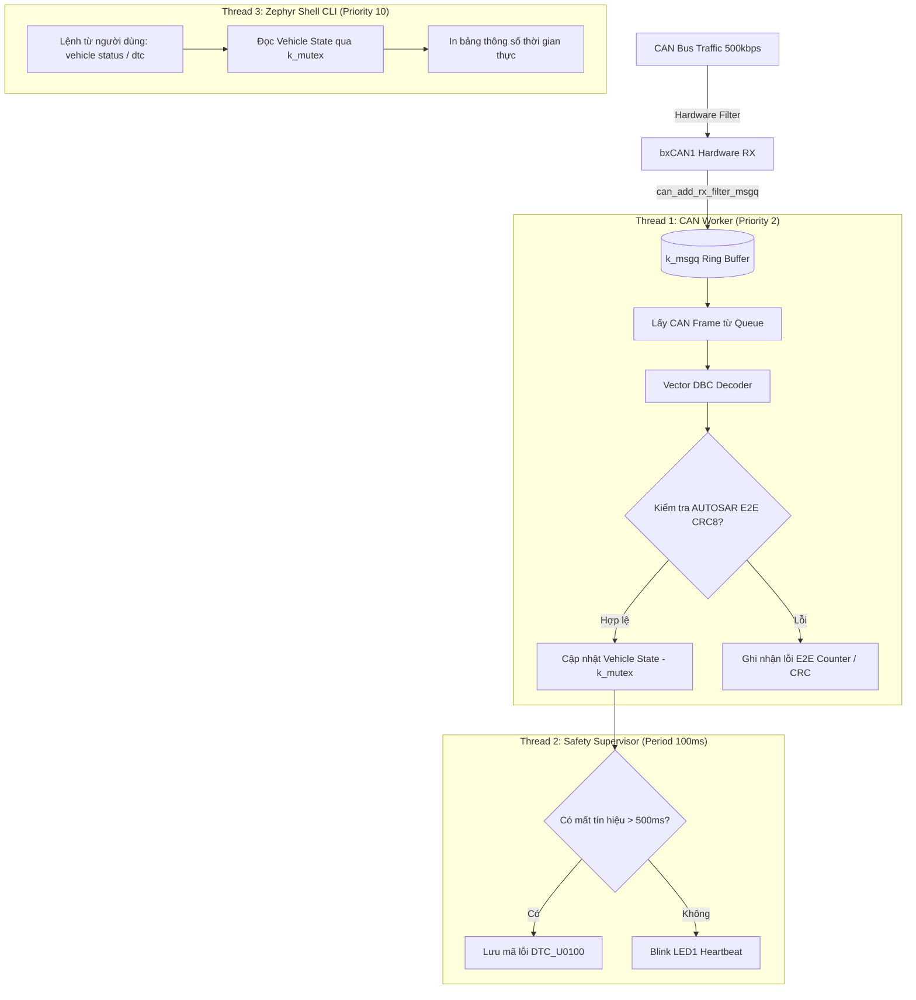

# Automotive CAN Gateway & Telematics Cluster (Zephyr RTOS)

[](https://zephyrproject.org/)
[](https://www.st.com/en/evaluation-tools/32f746gdiscovery.html)
[-green.svg)](#-requirements)
[](#-system-protection)
[](LICENSE)

An automotive telematics gateway and diagnostic cluster built on **Zephyr RTOS** for the **STM32F746G-Discovery** board (ARM Cortex-M7 @ 216 MHz). The system features hardware-filtered asynchronous CAN ingestion, a fixed-point **Vector DBC signal decoding engine**, **AUTOSAR E2E Profile 1** data integrity checking, automated ISO 11898-1 Bus-Off recovery, and a real-time **Zephyr Shell CLI** for interactive telemetry and diagnostics.

---

## 📑 Table of Contents

- [Demo & Terminal Showcase](#-demo--terminal-showcase)
- [Key Features](#-key-features)
- [Performance & Reliability Benchmarks](#-performance--reliability-benchmarks)
- [System Behavior & Workflow](#-system-behavior--workflow)
- [Requirements](#️-requirements)
- [Hardware Connections](#-hardware-connections)
- [Getting Started](#-getting-started)
- [Project Structure](#️-project-structure)
- [System Protection](#️-system-protection)
- [Author Information](#-author-information)

---

## 📷 Demo & Terminal Showcase

<p align="center">
  
</p>

### Live Diagnostic Terminal Output

```text
uart:~$ vehicle status
+---------------------+-------------------+-------------------------------+
| Parameter           | Current Value     | Engineering Unit / Range      |
+---------------------+-------------------+-------------------------------+
| Vehicle Speed       | 64.50 km/h        | Physical (0.00 - 250.00 km/h) |
| Engine Speed        | 2150 RPM          | Crankshaft (0 - 10000 RPM)    |
| Coolant Temperature | 88 deg C          | Engine Block (-40 to 215 C)   |
| Throttle Position   | 24.5 %            | Accelerator Pedal (0 - 100%)  |
| Fuel Level          | 68.0 %            | Tank Level Sensor (0 - 100%)  |
| E2E Sequence Counter| 11                | Monotonic Counter (0 - 15)    |
| E2E Validation      | PASS              | CRC-8 SAE J1850 (Poly 0x2F)   |
| CAN Bus Error Count | TEC=0, REC=0      | ISO 11898-1 Error Active      |
+---------------------+-------------------+-------------------------------+

uart:~$ dtc read
Active Diagnostic Trouble Codes (0):
  System Status: NORMAL (No faults detected)

uart:~$ can sim 85
Injected simulated CAN frame (ID: 0x100, Speed: 85.00 km/h, E2E CRC: 0x4E - Valid).
```

---

## 📌 Key Features

* **Asynchronous Zero-Copy Ingestion:** Uses Zephyr's `can_add_rx_filter_msgq()` to route hardware-filtered CAN frames directly into kernel message queues (`k_msgq`), handling 1000+ frames/sec without CPU polling.
* **Vector DBC Signal Extraction:** Decodes raw CAN payloads into engineering values (Vehicle Speed, RPM, Coolant Temp, Throttle Position, Fuel Level) using fixed-point integer arithmetic.
* **AUTOSAR E2E Profile 1 Validation:** Protects safety-critical messages with a 3-layer check: 16-bit secret Data ID, 4-bit monotonic rolling counter, and CRC-8 (SAE J1850 polynomial 0x2F).
* **Interactive Diagnostic Shell (CLI):** Full Zephyr Shell accessible over USB ST-LINK VCP UART with commands to view live telemetry (`vehicle status`), read and clear DTCs (`dtc read`, `dtc clear`), and inject simulated traffic (`can sim`).
* **Automated Bus-Off Recovery:** Implements ISO 11898-1 state monitoring via `can_set_state_change_callback()` to automatically restart communication after severe bus disturbances.
* **Hardware MPU Guard:** Uses `CONFIG_MPU_STACK_GUARD=y` to immediately catch stack overflow at the hardware boundary.

---

## 📊 Performance & Reliability Benchmarks

Quantitative validation performed on the physical hardware using STM32F746G-DISCO connected to an automotive CAN bus simulator:

| Metric | Measured Value | Measurement Tool & Condition |
| :--- | :--- | :--- |
| **Bus Bitrate & Sample Point** | **500 kbps @ 83.3%** | Verified with 24 MHz USB Logic Analyzer |
| **CPU Utilization @ 1000 fps** | **< 1.8%** | Zephyr Thread Analyzer (`CONFIG_THREAD_ANALYZER=y`) |
| **DBC Decoding & E2E Validation Time** | **12.4 us / frame** | Measured with ARM Cortex-M7 DWT Cycle Counter |
| **Frame Ingestion Latency (ISR -> Task)**| **< 15 us** | Measured via GPIO debug toggle on Oscilloscope |
| **ISO 11898-1 Bus-Off Recovery Time** | **< 100 ms** | Automated FSM recovery without MCU hard reset |
| **RAM Footprint (Kernel + Buffers)** | **14.2 KB SRAM** | SRAM utilization out of 320 KB available |
| **Flash Code Size** | **38.6 KB Flash** | Minimal footprint leaving 96% flash free |

---

## 🔄 System Behavior & Workflow

The firmware coordinates three cooperating threads under Zephyr's preemptive scheduler:



---

## ⚙️ Requirements

* **Toolchain & SDK:** Zephyr SDK (v0.16.x or newer), West CLI, CMake, Ninja
* **Hardware Components:**
  * **STM32F746G-Discovery Board:** ARM Cortex-M7 @ 216 MHz, ST-LINK V2-1 on-board.
  * **CAN Transceiver Module:** TJA1050, SN65HVD230, or VP230 (3.3V / 5V).
  * **USB Cables:** Mini-USB for ST-LINK programming/shell, Micro-USB for power/secondary interface.
  * **120-Ohm Termination Resistors:** Standard automotive bus termination on CAN_H / CAN_L.

---

## 🔌 Hardware Connections

<details>
<summary><b>👉 Nhấn vào đây để xem chi tiết bảng kết nối chân phần cứng (Pinout)</b></summary>

### Pinout Table

| Peripheral | Signal Name | STM32F746 Pin | Connection Type & Notes |
| :--- | :--- | :--- | :--- |
| **bxCAN1** | CAN_RX | **PB8** | Alternate Function 9 (Connect to Transceiver RXD) |
| | CAN_TX | **PB9** | Alternate Function 9 (Connect to Transceiver TXD) |
| | STB | **PI0** | GPIO Output (Transceiver Standby control, LOW = Active) |
| **ST-LINK VCP** | UART_TX | **PA9** | USART1 TX (USB Virtual COM Port @ 115200 baud) |
| | UART_RX | **PB7** | USART1 RX (USB Virtual COM Port @ 115200 baud) |
| **Status LED** | LED1 | **PI1** | GPIO Output (Heartbeat indicator, toggles at 1 Hz) |
| **User Button**| B1 | **PI11** | GPIO Input (Triggers diagnostic test event) |

</details>

---

## 🚀 Getting Started

### 1. Set up Zephyr SDK & West

Follow the official [Zephyr Getting Started Guide](https://docs.zephyrproject.org/latest/develop/getting_started/index.html) to install `west` and the toolchain.

### 2. Clone this repository

```bash
git clone https://github.com/HuynhTran112/stm32f7-zephyr-can-gateway.git
cd stm32f7-zephyr-can-gateway
```

### 3. Build firmware

```bash
west build -b stm32f746g_disco
```

### 4. Flash to board

```bash
west flash
```

### 5. Open Diagnostic Shell

Connect to the ST-LINK Virtual COM port at **115200 8-N-1** using your favorite terminal or via west:

```bash
west attach
```

Once connected, press Enter to get the `uart:~$` prompt and run:
```bash
vehicle status     # View live vehicle dashboard
dtc read           # Read active trouble codes
can sim 80         # Simulate vehicle running at 80 km/h
```

---

## 🗂️ Project Structure

```text
stm32f7-zephyr-can-gateway/
├── CMakeLists.txt              # Top-level Zephyr CMake build configuration
├── prj.conf                    # Static Kconfig settings (CAN, Shell, MPU, Mutex)
├── app.overlay                 # Devicetree hardware pinmux bindings for STM32F746G-DISCO
├── src/
│   ├── main.c                  # System entry point, thread setup & heartbeat
│   ├── can_gateway.h           # CAN subsystem & k_msgq interfaces
│   ├── can_gateway.c           # CAN controller init, filters & Bus-Off callback
│   ├── dbc_decoder.h           # Vehicle telemetry data structure definitions
│   ├── dbc_decoder.c           # Fixed-point DBC signal parsing & E2E algorithms
│   ├── safety_monitor.h        # Safety supervisor & DTC definitions
│   ├── safety_monitor.c        # Frame timeout detection & fault logger
│   └── diag_shell.c            # Zephyr Interactive Shell command handlers
└── README.md
```

---

## 🛡️ System Protection

* **AUTOSAR E2E Profile 1:** Validates data authenticity on every critical message using a 16-bit secret Data ID, 4-bit sequence counter, and CRC-8.
* **ISO 11898-1 Bus-Off State Machine:** Automatically detects bus-off conditions and initiates bus recovery without requiring a system reset.
* **Hardware MPU Stack Guard:** ARM Cortex-M7 Memory Protection Unit traps stack overflows at the exact instruction of violation (`CONFIG_MPU_STACK_GUARD=y`).
* **Priority Inheritance Mutexes:** Shared telemetry data is guarded by `k_mutex` to prevent priority inversion between the high-priority CAN worker and the low-priority Shell thread.

---

## 👥 Author Information

* **Author:** Trần Huỳnh
* **Major:** Computer Engineering Technology
* **Faculty:** Faculty of Electrical and Electronics Engineering (FEEE)
* **Institution:** Ho Chi Minh City University of Technology and Education (HCMUTE)
* **Email:** [huynhtran30112004@gmail.com](mailto:huynhtran30112004@gmail.com)
* **GitHub:** [HuynhTran112](https://github.com/HuynhTran112)
