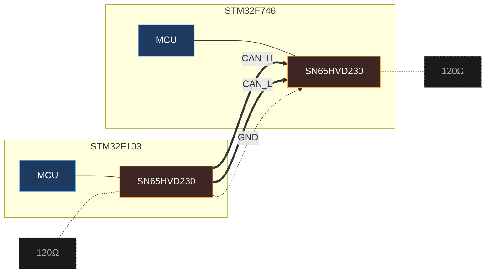

# Automotive CAN Telematics Gateway & Diagnostic Node

[-red.svg)](#node-1--stm32f746ng-telematics-gateway)
[-orange.svg)](#node-2--stm32f103c8t6-ecu-simulator)
[](#node-1--stm32f746ng-telematics-gateway)
[](#node-2--stm32f103c8t6-ecu-simulator)
[](#-định-dạng-bản-tin-can--vector-dbc)
[](LICENSE)

Một hệ thống **2 vi điều khiển giao tiếp qua CAN Bus vật lý**, mô phỏng lại đúng kiến trúc mạng CAN ô tô thật: một node đóng vai ECU động cơ/hộp số/phanh liên tục phát dữ liệu cảm biến (**Node 2 — STM32F103, bare-metal**), một node đóng vai Gateway/Cụm đồng hồ nhận, giải mã, xác thực an toàn dữ liệu theo chuẩn **AUTOSAR E2E Profile 1** và cung cấp giao diện chẩn đoán qua CLI (**Node 1 — STM32F746, Zephyr RTOS**).

---

## 📑 Mục Lục

- [Kiến Trúc Tổng Quan](#-kiến-trúc-tổng-quan)
- [Tính Năng Chính](#-tính-năng-chính)
- [Định Dạng Bản Tin CAN (Vector DBC)](#-định-dạng-bản-tin-can--vector-dbc)
- [Luồng Dữ Liệu End-to-End](#-luồng-dữ-liệu-end-to-end)
- [Yêu Cầu Phần Cứng](#️-yêu-cầu-phần-cứng)
- [Sơ Đồ Đấu Dây](#-sơ-đồ-đấu-dây)
- [Bắt Đầu Nhanh](#-bắt-đầu-nhanh)
  - [Node 1 — STM32F746NG Telematics Gateway](#node-1--stm32f746ng-telematics-gateway)
  - [Node 2 — STM32F103C8T6 ECU Simulator](#node-2--stm32f103c8t6-ecu-simulator)
- [Bộ Lệnh Chẩn Đoán (Zephyr Shell CLI)](#-bộ-lệnh-chẩn-đoán-zephyr-shell-cli)
- [Cấu Trúc Thư Mục](#️-cấu-trúc-thư-mục)
- [Giới Hạn Hiện Tại & Hướng Phát Triển](#️-giới-hạn-hiện-tại--hướng-phát-triển)
- [Thông Tin Tác Giả](#-thông-tin-tác-giả)

---

## 🧭 Kiến Trúc Tổng Quan

```mermaid
flowchart LR
    subgraph B2["🔧 NODE 2 — STM32F103C8T6"]
        direction TB
        S2["Cảm biến giả lập<br/>speed · rpm · gear · torque · brake"]
        E2["DBC Encoder<br/>CRC-8 + Rolling Counter"]
        M2["3x TX Mailbox"]
        S2 --> E2 --> M2
    end

    M2 ==>|"CAN_H / CAN_L · 500 kbps"| BUS(("CAN Bus"))
    BUS ==> F1

    subgraph B1["🖥️ NODE 1 — STM32F746NG"]
        direction TB
        F1["Filter Bank<br/>0x120–0x127"] --> Q1[("k_msgq")]
        Q1 --> W1["can_worker<br/>decode + E2E check"]
        W1 --> D1[("telemetry<br/>+ DTC")]
        D1 --> CLI1["Shell CLI"]
    end

    classDef node2 fill:#2d2d2d,stroke:#ff9800,color:#fff,stroke-width:2px
    classDef node1 fill:#2d2d2d,stroke:#2196f3,color:#fff,stroke-width:2px
    classDef bus fill:#1a1a1a,stroke:#4caf50,color:#4caf50,stroke-width:2px
    class S2,E2,M2 node2
    class F1,Q1,W1,D1,CLI1 node1
    class BUS bus
```



Node 2 phát 3 bản tin CAN mỗi 100ms, đóng vai ECU động cơ/hộp số/phanh. Node 1 nhận, giải mã theo AUTOSAR E2E, giám sát an toàn và trả lời qua Shell — bare-metal ở một đầu, Zephyr RTOS ở đầu còn lại.

---

## 📌 Tính Năng Chính

* **Mạng CAN 2 node thật, không loopback:** 2 board vật lý tách biệt, nối qua bus vi sai CAN_H/CAN_L với 2 IC Transceiver và điện trở đầu cuối 120Ω — kiểm chứng đúng tầng vật lý, không mô phỏng nội bộ.
* **3 bản tin CAN theo đúng hệ thống con ô tô:** `0x123` Engine (tốc độ/RPM/nhiệt độ nước), `0x124` Transmission (tay số/mô-men xoắn), `0x125` Chassis (áp lực phanh) — mỗi bản tin có Rolling Counter riêng, phát gần như đồng thời qua 3 Mailbox phần cứng của bxCAN.
* **Xác thực 2 lớp AUTOSAR E2E Profile 1:** CRC-8 (đa thức SAE J1850 `0x2F`, tính bằng bảng tra Lookup Table 256 phần tử) + Rolling Counter kiểu delta (phân biệt khung trùng lặp / rớt 1 khung / rớt nhiều khung).
* **Bộ lọc phần cứng theo dải ID:** 1 Filter Bank (`id=0x120, mask=0x7F8`) lọc trọn cả 3 bản tin hiện tại và chừa chỗ mở rộng thêm ECU mới trong cùng dải mà không cần thêm filter.
* **Giám sát an toàn thời gian thực (DTC):** phát hiện quá nhiệt động cơ (>105°C → `DTC_P0115`), quá vòng tua (>6500 RPM → `DTC_P0219`), mất tín hiệu CAN >1000ms (`DTC_U0100`), nhấp nháy LED cảnh báo (PI1).
* **Thống kê mạng CAN thời gian thực:** tổng số khung, tỉ lệ hợp lệ E2E, số lỗi CRC, số khung rớt, đếm riêng theo từng ID — qua lệnh `can stat`.
* **Bộ mô phỏng & bơm lỗi tích hợp trong Node 1:** `sim_thread` tự phát dữ liệu xe chạy (không cần Node 2 thật), lệnh `can inject overheat/overspeed/corrupt` để chủ động kiểm tra lớp an toàn.
* **Chẩn đoán qua Zephyr Shell CLI:** console tương tác qua UART (`vehicle status`, `dtc read/clear`, `can sim/auto/inject/stat/stat_reset`), không cần công cụ ngoài.
* **Bảo vệ ngăn xếp bằng MPU:** `CONFIG_HW_STACK_PROTECTION` + `CONFIG_MPU_STACK_GUARD` phát hiện tràn stack ngay lập tức thay vì âm thầm ghi đè bộ nhớ.

---

## 📨 Định Dạng Bản Tin CAN (Vector DBC)

Cả 3 bản tin dùng chung layout Byte 0-1 (CRC-8 + Rolling Counter) theo chuẩn AUTOSAR E2E, khác nhau ở Byte 2-5 (payload tín hiệu):

| Byte | `0x123` — Engine (MB0) | `0x124` — Transmission (MB1) | `0x125` — Chassis/Brake (MB2) |
| :--- | :--- | :--- | :--- |
| 0 | E2E CRC-8 (poly `0x2F`, seed `0xFF`, XOR-out `0xFF`, Data ID `0x1A2B`) | *(giống cột trái)* | *(giống cột trái)* |
| 1 | Rolling Counter 4-bit (0-15, modulo 16, **riêng theo từng ID**) | *(giống, bộ đếm độc lập)* | *(giống, bộ đếm độc lập)* |
| 2 | Vehicle Speed — 0-240 km/h, factor 1, Little-Endian | Gear Position — số 1-5 | Brake Pressure — % |
| 3-4 | Engine RPM — Little-Endian, factor 0.25 (`raw = data[3]\|(data[4]<<8)`, `RPM = raw>>2`) | Engine Torque (Nm) — Little-Endian | Wheel Speed — Little-Endian |
| 5 | Coolant Temp — `raw = temp + 40` | Oil Temp — `raw = temp + 40` | Pad Temp — `raw = temp + 40` |
| 6-7 | Reserved `0x00` | Reserved `0x00` | Reserved `0x00` |

DLC = 8 bytes cho cả 3 bản tin; Standard ID 11-bit.

---

## 🔄 Luồng Dữ Liệu End-to-End

1. **Node 2** đọc cảm biến giả lập mỗi 100ms, đóng gói cả 3 bản tin, tính CRC-8 (bảng tra) + tăng Rolling Counter riêng từng ID.
2. **`CAN1_Transmit()`** quét cờ `TME0/TME1/TME2`, chọn Mailbox phần cứng đang rảnh cho từng bản tin — 3 khung được nạp gần như đồng thời thay vì xếp hàng chờ nhau.
3. Bus vật lý phân xử theo cơ chế bitwise arbitration (ID nhỏ hơn thắng) — `0x123` luôn được phát trước `0x124`, `0x124` trước `0x125` nếu đụng độ.
4. **Node 1** nhận qua Filter Bank dải `0x120-0x127`, đẩy vào `k_msgq` (Zero-CPU khi rảnh).
5. **`can_worker_thread`** (ưu tiên 5) giải mã theo `switch(can_id)`, xác thực CRC-8 + Rolling Counter delta, gộp kết quả vào 1 struct `VehicleTelemetry_t` dùng chung (mỗi ID chỉ cập nhật đúng các trường liên quan, giữ nguyên giá trị các trường khác).
6. **`safety_thread`** (ưu tiên 6) quét mỗi 200ms, so ngưỡng nhiệt độ/RPM, cập nhật DTC, điều khiển LED cảnh báo (PI1).
7. Người dùng truy vấn qua **Shell CLI** trên UART: `vehicle status`, `can stat`, `dtc read`.

---

## ⚙️ Yêu Cầu Phần Cứng

| Hạng mục | Node 1 (Gateway) | Node 2 (ECU Simulator) |
| :--- | :--- | :--- |
| **Board** | STM32F746G-Discovery | STM32F103C8T6 "Blue Pill" |
| **Toolchain** | West + Zephyr SDK (`arm-zephyr-eabi-gcc`) | `arm-zephyr-eabi-gcc`/`arm-none-eabi-gcc` (Makefile, CMake, hoặc Keil `uvprojx`) |
| **IC Transceiver CAN** | 1x module (SN65HVD230 3.3V hoặc TJA1050 5V) | 1x module (khuyến nghị SN65HVD230 3.3V cho Blue Pill) |
| **Khác** | Cáp Mini-USB (ST-LINK) | Mạch nạp ST-LINK/USB-TTL rời (Blue Pill không có ST-LINK on-board) |
| **Chung** | 2 dây xoắn đôi CAN_H/CAN_L nối giữa 2 module Transceiver, 2 điện trở đầu cuối 120Ω (mỗi module 1 cái, đo tổng ~60Ω khi ngắt nguồn), dây mass chung |

---

## 🔌 Sơ Đồ Đấu Dây



Trở đầu cuối 120Ω gắn ở mỗi đầu bus — đo CAN_H/CAN_L khi ngắt nguồn phải ra khoảng 60Ω (2 trở song song).

<details>
<summary><b>👉 Chi tiết chân nối từng board</b></summary>

**Node 1 (STM32F746G-Discovery):**
| Tín hiệu | Chân | Ghi chú |
| :--- | :--- | :--- |
| CAN1_RX / CAN1_TX | PB8 / PB9 | Khai báo qua `pinctrl-0` trong `app.overlay` |
| Transceiver STB (Standby) | PI0 | Kéo LOW để đánh thức IC Transceiver trước khi init CAN |
| LED cảnh báo (Warning) | PI1 | Nhấp nháy khi có DTC active |

**Node 2 (STM32F103 Blue Pill):**
| Tín hiệu | Chân mặc định | Chân Remap (`USE_CAN_REMAP_PB8_PB9=1`) |
| :--- | :--- | :--- |
| CAN_RX / CAN_TX | PA11 / PA12 | PB8 / PB9 |
| LED báo hiệu chu kỳ phát | PC13 | — |

*(Nếu dùng module TJA1050 thay vì SN65HVD230: cấp nguồn 5V cho Transceiver, nối chân STB/Rs xuống GND.)*
</details>

---

## 🚀 Bắt Đầu Nhanh

### Node 1 — STM32F746NG Telematics Gateway

```bash
cd node1_stm32f7_gateway
west build -b stm32f746g_disco .
west flash
```
Mở terminal UART (115200 baud) để thấy log khởi động và gõ lệnh Shell. Mặc định firmware chạy ở `CAN_MODE_NORMAL` (nhận qua PB8/PB9 thật). Muốn tự test độc lập không cần Node 2 thật, có 2 cách — cả hai đều cần **sửa file trước khi build** (macro `USE_CAN_LOOPBACK_MODE` chưa được nối vào `CMakeLists.txt` nên build flag `-D` không có tác dụng):
1. Thêm dòng `target_compile_definitions(app PRIVATE USE_CAN_LOOPBACK_MODE)` vào `CMakeLists.txt`, hoặc
2. Bỏ comment dòng `/* loopback; */` trong `app.overlay`.

Sau đó kết hợp lệnh `can auto on` để `sim_thread` tự phát dữ liệu giả lập.

### Node 2 — STM32F103C8T6 ECU Simulator

```bash
cd node2_stm32f103_ecu
make            # hoặc: cmake -B build && cmake --build build
```
Nạp `stm32f103_node.bin`/`.hex` bằng ST-LINK hoặc USB-TTL (bootloader UART). Đèn LED PC13 nhấp nháy đều 100ms xác nhận đang phát dữ liệu thành công. Dự án cũng kèm sẵn `stm32f103_node.uvprojx` cho ai quen dùng Keil MDK.

**Kiểm thử toàn hệ thống:** nạp cả 2 board, nối bus CAN như sơ đồ trên, mở Shell của Node 1, gõ `can stat` — số đếm cả 3 ID (`id_123/124/125_count`) phải tăng đều nhau ở tần số 10Hz; gõ `vehicle status` để xem dữ liệu gộp từ cả 3 bản tin.

---

## 💻 Bộ Lệnh Chẩn Đoán (Zephyr Shell CLI)

| Lệnh | Chức năng |
| :--- | :--- |
| `vehicle status` | Hiển thị tốc độ, RPM, nhiệt độ nước, tay số, mô-men xoắn, áp lực phanh, trạng thái E2E |
| `dtc read` | Liệt kê các mã lỗi chẩn đoán (DTC) đang active |
| `dtc clear` | Xoá toàn bộ DTC |
| `can stat` | Thống kê mạng CAN: tổng khung, tỉ lệ hợp lệ, lỗi CRC, khung rớt, đếm riêng theo từng ID |
| `can stat_reset` | Đặt lại toàn bộ thống kê về 0 |
| `can sim <speed_kmh>` | Phát thủ công 1 khung dữ liệu giả lập |
| `can auto <on\|off>` | Bật/tắt `sim_thread` tự phát dữ liệu xe chạy 5Hz (dùng khi test không có Node 2) |
| `can inject <overheat\|overspeed\|corrupt>` | Chủ động bơm lỗi để kiểm tra lớp an toàn AUTOSAR E2E và DTC |

---

## 🗂️ Cấu Trúc Thư Mục

```text
automotive_can_gateway_cluster/
├── node1_stm32f7_gateway/          # Node 1 — Zephyr RTOS, STM32F746NG
│   ├── src/
│   │   ├── main.c                  # 2 thread chính (can_worker prio5, safety prio6)
│   │   ├── can_gateway.c/.h        # Init CAN, Transceiver STB, Filter Bank dải ID
│   │   ├── dbc_decoder.c/.h        # Giải mã DBC theo ID, xác thực E2E, thống kê
│   │   ├── safety_monitor.c/.h     # Máy trạng thái DTC
│   │   └── diag_shell.c            # Shell CLI + sim_thread (prio7) + bộ bơm lỗi
│   ├── app.overlay                 # Devicetree: chân CAN1, LED, Transceiver STB
│   ├── prj.conf                    # Kconfig: CAN, Shell, MPU Stack Guard, Log
│   └── CMakeLists.txt
├── node2_stm32f103_ecu/            # Node 2 — Bare-Metal, STM32F103C8T6
│   ├── src/
│   │   ├── main.c                  # Vòng lặp mô phỏng cảm biến + phát 3 bản tin/100ms
│   │   ├── can_f103.c               # Driver bxCAN thanh ghi trực tiếp, TX round-robin 3 Mailbox
│   │   └── e2e_encoder.c            # Đóng gói DBC + CRC-8 (Lookup Table) cho 3 loại bản tin
│   ├── include/can_f103.h, e2e_encoder.h
│   ├── startup_stm32f103c8tx.s     # Vector table & reset handler
│   ├── stm32f103c8tx.ld            # Linker script
│   ├── Makefile / CMakeLists.txt / stm32f103_node.uvprojx  # 3 cách build tương đương
│   └── README.md                   # Tài liệu riêng chi tiết đấu dây/build Node 2
└── README.md                       # File này — tổng quan toàn hệ thống
```

---

## ⚠️ Giới Hạn Hiện Tại & Hướng Phát Triển

* **`safety_monitor` mới kiểm tra 2 ngưỡng từ bản tin Engine** (nhiệt độ nước >105°C, RPM >6500) — chưa có DTC riêng cho áp lực phanh bất thường (`0x125`) hay mô-men xoắn/tay số bất thường (`0x124`), dù dữ liệu đã được giải mã đầy đủ. Hướng mở rộng tự nhiên: thêm ngưỡng cho 2 bản tin mới.
* **Node 1 không tự tay cấu hình `CAN_BTR`** — Zephyr tự tính bit-timing từ `sample-point=<875>` trong Devicetree. Việc cấu hình thanh ghi bằng tay ở mức bare-metal chỉ có ở Node 2.
* **`can_add_rx_filter_msgq()` là 1 dòng gọi Zephyr driver** — toàn bộ ISR đọc FIFO/giải phóng `RFOM0` nằm trong driver `can_stm32_bxcan` có sẵn của Zephyr, không phải code tự viết trong project.
* **Node 2 mặc định lọc accept-all** (`CAN1_Filter_Config(0x000, 0x000)`) — không lọc theo ID vì chỉ cần nghe phản hồi từ Node 1 khi debug hai chiều.
* **`CAN1_Transmit()` không thực sự phát hiện lỗi Acknowledge** — giá trị `false` nó trả về chỉ phản ánh "cả 3 Mailbox đang bận" (đọc cờ `TME0/1/2`), không đọc thanh ghi lỗi `CAN_ESR` (LEC/ACK error). Khi bus mất ACK thật (không có Node 1 lắng nghe), phần cứng bxCAN sẽ tự lặp lại việc gửi ở mức thấp (trừ khi bật `NART`), không có cơ chế phần mềm nào ở Node 2 chủ động phát hiện và báo lỗi việc này.

---

## 👥 Thông Tin Tác Giả

* **Major:** Computer Engineering Technology
* **Institution:** Ho Chi Minh City University of Technology and Education (HCMUTE)
