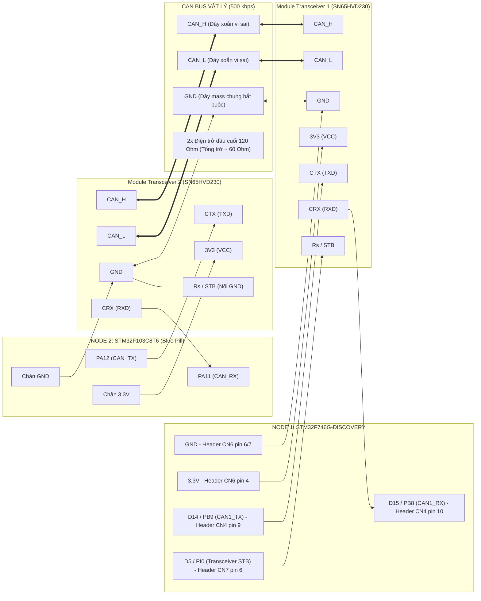

# Automotive CAN Telematics Gateway & Diagnostic Node

[-red.svg)](#node-1-stm32f746ng-telematics-gateway)
[-orange.svg)](#node-2-stm32f103c8t6-ecu-simulator)
[](#node-1-stm32f746ng-telematics-gateway)
[](#node-2-stm32f103c8t6-ecu-simulator)
[](#dinh-dang-ban-tin-can-vector-dbc)
[](LICENSE)

Hệ thống gồm 2 vi điều khiển giao tiếp qua CAN Bus vật lý, mô phỏng kiến trúc mạng CAN trên ô tô: một node đóng vai ECU động cơ/hộp số/phanh liên tục phát dữ liệu cảm biến (Node 2: STM32F103, bare-metal), một node đóng vai Gateway/Cụm đồng hồ nhận, giải mã, xác thực an toàn dữ liệu theo chuẩn AUTOSAR E2E Profile 1 và cung cấp giao diện chẩn đoán qua CLI (Node 1: STM32F746, Zephyr RTOS).

---

## Mục Lục

- [Kiến Trúc Tổng Quan](#kien-truc-tong-quan)
- [Tính Năng Chính](#tinh-nang-chinh)
- [Định Dạng Bản Tin CAN (Vector DBC)](#dinh-dang-ban-tin-can-vector-dbc)
- [Luồng Dữ Liệu End-to-End](#luong-du-lieu-end-to-end)
- [Yêu Cầu Phần Cứng](#yeu-cau-phan-cung)
- [Sơ Đồ Đấu Dây](#so-do-dau-day)
  - [Sơ đồ khối đấu nối](#so-do-khoi-dau-noi)
  - [Bảng chân kết nối chi tiết](#bang-chan-ket-noi-chi-tiet)
  - [Quy trình đo kiểm tra phần cứng](#quy-trinh-do-kiem-tra-phan-cung)
- [Bắt Đầu Nhanh](#bat-dau-nhanh)
  - [Node 1: STM32F746NG Telematics Gateway](#node-1-stm32f746ng-telematics-gateway)
  - [Node 2: STM32F103C8T6 ECU Simulator](#node-2-stm32f103c8t6-ecu-simulator)
- [Bộ Lệnh Chẩn Đoán (Zephyr Shell CLI)](#bo-lenh-chan-doan-zephyr-shell-cli)
- [Cấu Trúc Thư Mục](#cau-truc-thu-muc)
- [Giới Hạn Hiện Tại & Hướng Phát Triển](#gioi-han-hien-tai--huong-phat-trien)
- [Thông Tin Tác Giả](#thong-tin-tac-gia)

---

## Kiến Trúc Tổng Quan


Node 2 phát 3 bản tin CAN mỗi 100ms đóng vai trò ECU động cơ, hộp số và phanh. Node 1 nhận, giải mã theo AUTOSAR E2E, giám sát an toàn và phản hồi qua Shell. Hệ thống kết hợp lập trình bare-metal trực tiếp thanh ghi ở một đầu và hệ điều hành Zephyr RTOS ở đầu còn lại.

---

## Tính Năng Chính

* **Mạng CAN 2 node độc lập:** 2 bo mạch vật lý tách biệt nối qua bus vi sai CAN_H/CAN_L bằng 2 IC Transceiver và điện trở đầu cuối 120 Ohm, kiểm chứng đúng tầng vật lý ISO 11898.
* **3 bản tin CAN theo phân hệ ô tô:** `0x123` Engine (tốc độ, vòng tua, nhiệt độ nước), `0x124` Transmission (tay số, mô-men xoắn), `0x125` Chassis (áp lực phanh). Mỗi bản tin mang Rolling Counter độc lập, phát đồng thời qua 3 Mailbox phần cứng của bxCAN.
* **Xác thực 2 lớp AUTOSAR E2E Profile 1:** CRC-8 (đa thức SAE J1850 `0x2F`, tính bằng bảng tra 256 phần tử) kết hợp Rolling Counter dạng delta (phân biệt khung lặp, rớt 1 khung hoặc rớt nhiều khung).
* **Bộ lọc phần cứng theo dải ID:** 1 Filter Bank (`id=0x120, mask=0x7F8`) bao trọn 3 bản tin và dự phòng không gian cho các ECU mở rộng trong cùng dải ID.
* **Giám sát an toàn thời gian thực (DTC):** Phát hiện quá nhiệt động cơ (>105°C gán `DTC_P0115`), quá vòng tua (>6500 RPM gán `DTC_P0219`), mất tín hiệu CAN quá 1000ms (`DTC_U0100`), nhấp nháy đèn cảnh báo PI1.
* **Thống kê mạng thời gian thực:** Đếm tổng khung nhận, tỉ lệ hợp lệ E2E, số lỗi CRC, số khung rớt và lưu lượng riêng từng ID qua lệnh `can stat`.
* **Bộ mô phỏng và chẩn đoán tích hợp trong Node 1:** `sim_thread` hỗ trợ phát dữ liệu xe chạy nội bộ; tập lệnh `can inject overheat/overspeed/corrupt` cho phép chủ động bơm lỗi kiểm thử logic an toàn.
* **Chẩn đoán qua Zephyr Shell CLI:** Giao diện dòng lệnh tương tác qua UART (`vehicle status`, `dtc read/clear`, `can sim/auto/inject/stat/stat_reset`).
* **Bảo vệ ngăn xếp bằng phần cứng MPU:** Sử dụng `CONFIG_HW_STACK_PROTECTION` và `CONFIG_MPU_STACK_GUARD` phát hiện lỗi tràn stack tức thì.

---

## Định Dạng Bản Tin CAN (Vector DBC)

Cả 3 bản tin dùng chung định dạng Byte 0-1 (CRC-8 và Rolling Counter) theo chuẩn AUTOSAR E2E, khác nhau ở Byte 2-5 (payload tín hiệu):

| Byte | `0x123`: Engine (MB0) | `0x124`: Transmission (MB1) | `0x125`: Chassis/Brake (MB2) |
| :--- | :--- | :--- | :--- |
| 0 | E2E CRC-8 (poly `0x2F`, seed `0xFF`, XOR-out `0xFF`, Data ID `0x1A2B`) | Giống cột trái | Giống cột trái |
| 1 | Rolling Counter 4-bit (0-15, modulo 16, riêng từng ID) | Giống, bộ đếm độc lập | Giống, bộ đếm độc lập |
| 2 | Vehicle Speed: 0-240 km/h, factor 1, Little-Endian | Gear Position: 1-5 | Brake Pressure: % |
| 3-4 | Engine RPM: Little-Endian, factor 0.25 (`raw = d[3] \| (d[4]<<8)`, `RPM = raw>>2`) | Engine Torque (Nm): Little-Endian | Wheel Speed: Little-Endian |
| 5 | Coolant Temp: `raw = temp + 40` | Oil Temp: `raw = temp + 40` | Pad Temp: `raw = temp + 40` |
| 6-7 | Reserved `0x00` | Reserved `0x00` | Reserved `0x00` |

DLC = 8 bytes cho cả 3 bản tin; Chuẩn Standard ID 11-bit.

---

## Luồng Dữ Liệu End-to-End

1. **Node 2** định kỳ 100ms đọc cảm biến giả lập, đóng gói 3 bản tin, tính CRC-8 qua bảng tra và tăng Rolling Counter tương ứng.
2. **`CAN1_Transmit()`** kiểm tra cờ `TME0/TME1/TME2`, chọn Mailbox phần cứng rảnh để nạp 3 khung gần như đồng thời mà không bị trễ luân phiên.
3. Bus CAN phân xử theo cơ chế bitwise arbitration: bản tin `0x123` được ưu tiên truyền trước `0x124`, sau đó tới `0x125`.
4. **Node 1** thu nhận qua Filter Bank dải `0x120-0x127`, nạp vào hàng đợi `k_msgq`.
5. **`can_worker_thread`** (Priority 5) giải mã theo `can_id`, xác thực CRC-8 và delta counter, cập nhật cấu trúc `VehicleTelemetry_t`.
6. **`safety_thread`** (Priority 6) chu kỳ 200ms kiểm tra ngưỡng vận hành, cập nhật cờ DTC và điều khiển LED cảnh báo (PI1).
7. Người vận hành truy vấn trạng thái qua **Shell CLI** trên cổng UART.

---

## Yêu Cầu Phần Cứng

| Hạng mục | Node 1 (Gateway) | Node 2 (ECU Simulator) |
| :--- | :--- | :--- |
| **Bo mạch** | STM32F746G-Discovery | STM32F103C8T6 (Blue Pill) |
| **Toolchain** | West + Zephyr SDK (`arm-zephyr-eabi-gcc`) | GCC Arm Toolchain (`arm-none-eabi-gcc`) hoặc Keil MDK |
| **Module CAN Transceiver** | 1x Module (SN65HVD230 3.3V hoặc TJA1050 5V) | 1x Module (SN65HVD230 3.3V hoặc TJA1050 5V) |
| **Nạp chương trình** | Cáp Mini-USB (ST-LINK on-board) | Mạch nạp ST-LINK V2 rời hoặc nạp qua UART bootloader |
| **Kết nối vật lý** | Cáp xoắn đôi vi sai CAN_H/CAN_L, dây nối đất GND chung, 2 điện trở kết thúc 120 Ohm |

---

## Sơ Đồ Đấu Dây

### Sơ đồ khối đấu nối



### Bảng chân kết nối chi tiết

#### 1. Node 1: STM32F746G-Discovery sang Transceiver 1

| Chân trên STM32F746G-Discovery | Vị trí Header vật lý | Chân trên Transceiver (SN65HVD230) | Chức năng kỹ thuật |
| :--- | :--- | :--- | :--- |
| **PB9** (CAN1_TX) | **D14** (Header Arduino CN4, Pin 9) | **CTX** / **TXD** (Driver Input) | Tín hiệu phát CAN từ MCU sang Transceiver |
| **PB8** (CAN1_RX) | **D15** (Header Arduino CN4, Pin 10) | **CRX** / **RXD** (Receiver Output) | Tín hiệu nhận CAN từ Transceiver về MCU |
| **PI0** (GPIO Output) | **D5** (Header Arduino CN7, Pin 6) | **Rs** / **STB** (Standby) | MCU kéo LOW để kích hoạt Transceiver hoạt động |
| **3.3V** | Header CN6, Pin 4 (hoặc Pin 2 IOREF) | **3V3** / **VCC** | Nguồn nuôi IC Transceiver (3.3V) |
| **GND** | Header CN6, Pin 6/7 (hoặc CN4 Pin 7) | **GND** | Nối đất hệ thống Node 1 |

*Ghi chú cho Node 1:*
- Nếu sử dụng module transceiver **TJA1050 (5V)** thay vì SN65HVD230: cấp nguồn cho transceiver từ chân **5V** (Header CN6, Pin 5). Chân PB8 trên STM32F746 là chân chuẩn 5V-tolerant (FT) nên nhận an toàn tín hiệu 5V từ RXD của TJA1050.
- Đèn LED cảnh báo an toàn **PI1** (User LED 1 - Xanh lá) đã tích hợp sẵn trên bo mạch (LED LD1 gần nút nhấn), không cần đấu dây thêm.

---

#### 2. Node 2: STM32F103C8T6 Blue Pill sang Transceiver 2

| Chân trên STM32F103C8T6 | Vị trí chân | Chân trên Transceiver (SN65HVD230) | Chức năng kỹ thuật |
| :--- | :--- | :--- | :--- |
| **PA12** (CAN_TX mặc định) | Chân PA12 trên thanh header | **CTX** / **TXD** | Tín hiệu phát CAN từ STM32F103 |
| **PA11** (CAN_RX mặc định) | Chân PA11 trên thanh header | **CRX** / **RXD** | Tín hiệu nhận CAN về STM32F103 |
| **GND** | Chân GND của Blue Pill | **Rs** / **STB** | Nối Mass trực tiếp để module luôn ở chế độ Normal |
| **3.3V** | Chân 3.3V của Blue Pill | **3V3** / **VCC** | Cấp nguồn nuôi cho SN65HVD230 |
| **GND** | Chân GND của Blue Pill | **GND** | Nối đất hệ thống Node 2 |

*Ghi chú cho Node 2:*
- Nếu cấu hình remap trong firmware (`USE_CAN_REMAP_PB8_PB9 = 1`): Chuyển dây `PA11` sang `PB8` và `PA12` sang `PB9`.
- Nếu dùng module **TJA1050 (5V)**: Nối chân VCC của module vào chân **5V** trên Blue Pill (lấy nguồn từ cổng USB).
- Đèn LED **PC13** tích hợp sẵn trên bo Blue Pill tự động đảo trạng thái mỗi khi phát thành công chu kỳ bản tin 100ms.

---

#### 3. Đường truyền CAN Bus giữa 2 Module Transceiver

| Cực tín hiệu Transceiver 1 | Cực tín hiệu Transceiver 2 | Quy cách cáp nối |
| :--- | :--- | :--- |
| **CAN_H** | **CAN_H** | Dây cáp xoắn đôi (Twisted Pair) |
| **CAN_L** | **CAN_L** | Dây cáp xoắn đôi (Twisted Pair) |
| **GND** | **GND** | **Bắt buộc nối chung Mass giữa 2 bo mạch** |

---

### Quy trình đo kiểm tra phần cứng

1. **Kiểm tra dây GND chung:** Đo điện áp chênh lệch thang DC giữa GND của Bo 1 và GND của Bo 2 khi bật nguồn, điện áp phải đạt xấp xỉ 0V. Nếu không có dây GND chung, chênh lệch thế đất có thể vượt dải Common-Mode cho phép (-2V đến +7V) gây hỏng bộ thu.
2. **Kiểm tra điện trở kết thúc (Termination Resistors):**
   - Tắt hoàn toàn nguồn điện cấp cho cả 2 bo mạch.
   - Dùng đồng hồ VOM đặt ở thang đo trở kháng (Ohm), đo trực tiếp giữa 2 điểm **CAN_H** và **CAN_L**.
   - **Tiêu chuẩn:** Giá trị đo được phải nằm trong khoảng **55 Ohm đến 65 Ohm** (tương đương 2 điện trở 120 Ohm mắc song song: `120 // 120 = 60 Ohm`).
   - Nếu đo được xấp xỉ 120 Ohm: 1 trong 2 module bị thiếu trở hoặc chưa cắm jumper điện trở đầu cuối.
   - Nếu đo được giá trị rất lớn (hở mạch): Cả 2 module chưa được gắn trở đầu cuối, cần cắm thêm 1 điện trở 120 Ohm ngoài vào mỗi đầu bus.

---

## Bắt Đầu Nhanh

### Node 1: STM32F746NG Telematics Gateway

```bash
cd node1_stm32f7_gateway
west build -b stm32f746g_disco .
west flash
```

Mở terminal UART ở tốc độ 115200 baud để theo dõi log và nhập lệnh Shell. Mặc định firmware chạy ở `CAN_MODE_NORMAL` (giao tiếp qua chân PB8/PB9 thực tế). Khi muốn tự kiểm thử mà không có Node 2 thật:
1. Thêm dòng `target_compile_definitions(app PRIVATE USE_CAN_LOOPBACK_MODE)` vào `CMakeLists.txt`, hoặc
2. Bỏ chú thích dòng `/* loopback; */` trong file `app.overlay`.

Sau đó gõ lệnh `can auto on` để luồng `sim_thread` kích hoạt dữ liệu mô phỏng.

### Node 2: STM32F103C8T6 ECU Simulator

```bash
cd node2_stm32f103_ecu
make            # Hoặc: cmake -B build && cmake --build build
```

Nạp file `stm32f103_node.bin` hoặc `.hex` qua ST-LINK V2 hoặc USB-TTL. Đèn LED PC13 chớp tắt đều đặn mỗi 100ms xác nhận chu kỳ phát đang diễn ra. Thư mục mã nguồn cũng cung cấp sẵn project `stm32f103_node.uvprojx` cho Keil MDK.

**Kiểm thử liên lạc toàn hệ thống:**
1. Cấp nguồn cho cả 2 node và kết nối đủ 3 đường CAN_H, CAN_L, GND.
2. Trên console Shell của Node 1, nhập lệnh:
   ```text
   uart:~$ can stat
   ```
   Kiểm tra số đếm của 3 định danh `id_123_count`, `id_124_count`, `id_125_count` tăng đều với tần số 10 Hz và tỉ lệ hợp lệ đạt 100%.
3. Nhập lệnh:
   ```text
   uart:~$ vehicle status
   ```
   để xem toàn bộ thông số giải mã từ 3 phân hệ.

---

## Bộ Lệnh Chẩn Đoán (Zephyr Shell CLI)

| Lệnh | Chức năng thực thi |
| :--- | :--- |
| `vehicle status` | Hiển thị tốc độ xe, RPM, nhiệt độ nước làm mát, cấp số, mô-men xoắn, áp lực phanh và trạng thái E2E |
| `dtc read` | Đọc danh sách các mã lỗi chẩn đoán (DTC) đang kích hoạt |
| `dtc clear` | Xóa toàn bộ mã lỗi DTC và tắt đèn cảnh báo an toàn |
| `can stat` | Báo cáo thống kê: tổng khung, tỉ lệ E2E hợp lệ, số lỗi CRC, số khung mất và đếm theo từng ID |
| `can stat_reset` | Khởi tạo lại toàn bộ bộ đếm thống kê về 0 |
| `can sim <speed_kmh>` | Phát thủ công 1 khung dữ liệu giả lập với tốc độ chỉ định |
| `can auto <on\|off>` | Bật hoặc tắt luồng `sim_thread` tự phát dữ liệu xe chạy tần số 5 Hz |
| `can inject <overheat\|overspeed\|corrupt>` | Chủ động bơm lỗi vào bus để kiểm tra phản ứng của module an toàn DTC và CRC |

---

## Cấu Trúc Thư Mục

```text
automotive_can_gateway_cluster/
├── node1_stm32f7_gateway/          # Node 1: Zephyr RTOS trên STM32F746NG
│   ├── src/
│   │   ├── main.c                  # 2 luồng chính: can_worker (prio 5), safety (prio 6)
│   │   ├── can_gateway.c/.h        # Khởi tạo CAN, quản lý chân STB, cấu hình Filter Bank dải ID
│   │   ├── dbc_decoder.c/.h        # Bộ giải mã DBC theo ID, kiểm tra E2E, thống kê mạng
│   │   ├── safety_monitor.c/.h     # Máy trạng thái quản lý mã lỗi DTC
│   │   └── diag_shell.c            # Shell CLI, luồng mô phỏng sim_thread (prio 7), bộ bơm lỗi
│   ├── app.overlay                 # Devicetree: ánh xạ chân CAN1, LED cảnh báo, chân STB
│   ├── prj.conf                    # Cấu hình Kconfig: CAN Subsystem, Shell, MPU Stack Guard
│   └── CMakeLists.txt
├── node2_stm32f103_ecu/            # Node 2: Bare-Metal trên STM32F103C8T6
│   ├── src/
│   │   ├── main.c                  # Chu kỳ mô phỏng cảm biến và phát 3 bản tin/100ms
│   │   ├── can_f103.c              # Driver thanh ghi bxCAN, thuật toán round-robin 3 Mailbox
│   │   └── e2e_encoder.c           # Đóng gói DBC và tính CRC-8 (Lookup Table) cho 3 bản tin
│   ├── include/can_f103.h, e2e_encoder.h
│   ├── startup_stm32f103c8tx.s     # Vector table và mã Reset Handler
│   ├── stm32f103c8tx.ld            # Linker script phân bổ bộ nhớ Flash và SRAM
│   ├── Makefile / CMakeLists.txt / stm32f103_node.uvprojx
│   └── README.md                   # Hướng dẫn chi tiết biên dịch và nạp riêng cho Node 2
└── README.md                       # Tài liệu tổng quan toàn bộ hệ thống
```

---

## Giới Hạn Hiện Tại & Hướng Phát Triển

* **Mã lỗi DTC hiện tại:** Module `safety_monitor` đang tập trung giám sát 2 ngưỡng giới hạn từ bản tin động cơ (nhiệt độ nước >105°C và vòng tua >6500 RPM). Hướng mở rộng tiếp theo là bổ sung DTC cho áp lực phanh bất thường (`0x125`) và sai lệch cấp số/mô-men xoắn (`0x124`).
* **Cấu hình Bit Timing:** Node 1 sử dụng cơ chế tự động tính toán tham số thanh ghi `CAN_BTR` của Zephyr thông qua khai báo `sample-point = <875>` trong Devicetree. Việc can thiệp trực tiếp giá trị thanh ghi BRP, TS1, TS2 chỉ thực hiện ở Node 2 bare-metal.
* **Xử lý ngắt bộ đệm:** Hàm `can_add_rx_filter_msgq()` sử dụng driver `can_stm32_bxcan` tích hợp sẵn của Zephyr; việc đọc dữ liệu từ thanh ghi FIFO và giải phóng cờ `RFOM0` do driver đảm nhiệm.
* **Bộ lọc Node 2:** Node 2 hiện sử dụng bộ lọc chấp nhận tất cả (`CAN1_Filter_Config(0x000, 0x000)`) để đơn giản hóa quá trình nghe phản hồi thử nghiệm hai chiều.
* **Cơ chế báo lỗi ACK tại Node 2:** Hàm `CAN1_Transmit()` chỉ kiểm tra tính sẵn sàng của 3 Mailbox qua cờ `TME0/1/2` trong `CAN_TSR`. Nếu bus mất tín hiệu ACK vật lý từ Node 1, phần cứng bxCAN sẽ tự động phát lại mà không có cờ cảnh báo cấp phần mềm trả về ở tầng ứng dụng Node 2.

---

## Thông Tin Tác Giả

* **Chuyên ngành:** Kỹ thuật Kỹ thuật Máy tính (Computer Engineering Technology)
* **Đơn vị:** Trường Đại học Sư phạm Kỹ thuật TP.HCM (HCMUTE)
