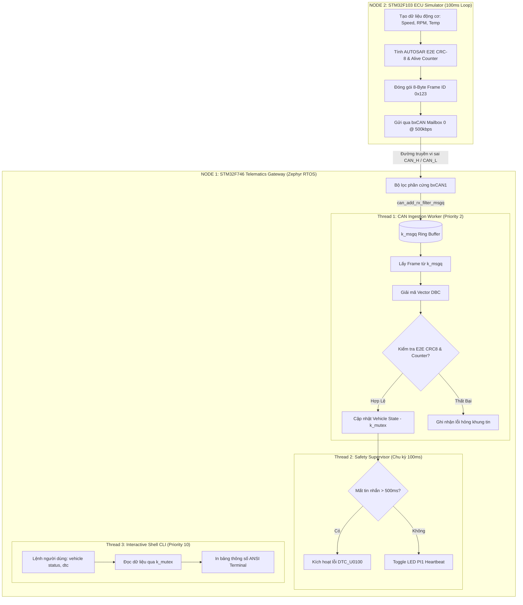

# Automotive CAN Network System: 2-Node Telematics Gateway & Powertrain ECU Simulator

[](https://zephyrproject.org/)
[](https://www.st.com/en/evaluation-tools/32f746gdiscovery.html)
[](#-node-2-powertrain-ecu-simulator)
[-green.svg)](#-can-network--dbc-specification)
[](#-safety-architecture--autosar-e2e)
[](LICENSE)

An end-to-end, dual-node automotive Controller Area Network (CAN) system demonstrating real-time vehicle telemetry transmission, validation, and diagnosis across two heterogeneous ARM architectures:

1. **Node 1 (Telematics Gateway & Diagnostic Cluster):** Running on **STM32F746G-DISCO** (ARM Cortex-M7 @ 216 MHz) powered by **Zephyr RTOS v3.7.0**. Features asynchronous hardware-filtered CAN frame ingestion (`k_msgq`), fixed-point **Vector DBC signal decoding**, **AUTOSAR E2E Profile 1** integrity checking, automated **ISO 11898-1 Bus-Off recovery**, and an interactive **Zephyr Shell CLI** for real-time telemetry inspection and DTC diagnosis.
2. **Node 2 (Powertrain Engine Control Unit - ECU Simulator):** Running on **STM32F103C8T6 Blue Pill** (ARM Cortex-M3 @ 72 MHz) implemented via a high-performance **100% Bare-Metal Register Driver**. Emulates an engine control module (ECM) periodically broadcasting live driving dynamics (Speed, RPM, Coolant Temp) with rolling counter and CRC-8 protection at 100 ms (10 Hz).

---

## 📑 Table of Contents

- [System Architecture & 2-Node Block Diagram](#-system-architecture--2-node-block-diagram)
- [Hardware Wiring & Pinout Guide](#-hardware-wiring--pinout-guide)
- [CAN Network & DBC Specification](#-can-network--dbc-specification)
- [Live Diagnostic Terminal Showcase](#-live-diagnostic-terminal-showcase)
- [Performance & Reliability Benchmarks](#-performance--reliability-benchmarks)
- [System Behavior & Multithreaded Workflow](#-system-behavior--multithreaded-workflow)
- [Safety Architecture & AUTOSAR E2E](#-safety-architecture--autosar-e2e)
- [1-Click Build & Quick Start Guide](#-1-click-build--quick-start-guide)
- [Project Directory Structure](#-project-directory-structure)
- [Author Information](#-author-information)

---

## 🏗️ System Architecture & 2-Node Block Diagram

```text
 ┌───────────────────────────────────────────┐                ┌───────────────────────────────────────────┐
 │    NODE 1: TELEMATICS GATEWAY CLUSTER     │                │     NODE 2: POWERTRAIN ECU SIMULATOR      │
 │  - Board: STM32F746G-DISCO                │                │  - Board: STM32F103C8T6 (Blue Pill)       │
 │  - Core: ARM Cortex-M7 @ 216 MHz          │                │  - Core: ARM Cortex-M3 @ 72 MHz           │
 │  - OS: Zephyr RTOS (Multi-threaded)       │                │  - Driver: Bare-metal Register (bxCAN)    │
 │  - Tasks: CAN Worker, Supervisor, Shell   │                │  - Period: 100 ms (10 Hz Periodic Transmit)│
 └─────────────────────┬─────────────────────┘                └─────────────────────┬─────────────────────┘
                       │ (PB8: RX, PB9: TX)                                         │ (PA11: RX, PA12: TX)
                       ▼                                                            ▼
            ┌─────────────────────┐                                      ┌─────────────────────┐
            │   CAN Transceiver   │                                      │   CAN Transceiver   │
            │ SN65HVD230/TJA1050  │                                      │ SN65HVD230/TJA1050  │
            └──────────┬──────────┘                                      └──────────┬──────────┘
                       │ CAN_H ────────────────────────────────────────────── CAN_H │
                       │ CAN_L ────────────────────────────────────────────── CAN_L │
                       │ GND   ────────────────────────────────────────────── GND   │ (Common Ground)
                       └─────────── [Bus CAN 500 kbps, 2x 120Ω Term Resistors] ─────┘
```

---

## 🔌 Hardware Wiring & Pinout Guide

### 1. Sơ Đồ Đấu Nối Tổng Thể (Complete Wiring Matrix)

| Module / Thiết Bị | Node 1: STM32F746G-DISCO | Module Transceiver 1 | Module Transceiver 2 | Node 2: STM32F103 (Blue Pill) |
| :--- | :--- | :--- | :--- | :--- |
| **Logic RX** | **PB8** (CN7 Pin 10 - SCL/D15) | **RXD** | — | — |
| **Logic TX** | **PB9** (CN7 Pin 9 - SDA/D14) | **TXD** | — | — |
| **Power (3.3V)** | **3.3V** (CN6 Pin 4) | **3V3 / VCC** | — | — |
| **Ground** | **GND** (CN6 Pin 6/7) | **GND** ──────┐ | ┌────── **GND** | **GND** |
| **Power (3.3V)** | — | — | **3V3 / VCC** | **3.3V** |
| **Logic RX** | — | — | **RXD** | **PA11** (hoặc PB8 nếu Remap) |
| **Logic TX** | — | — | **TXD** | **PA12** (hoặc PB9 nếu Remap) |
| **Bus vi sai CAN_H** | — | **CAN_H** ─────────── | ─────────── **CAN_H** | — |
| **Bus vi sai CAN_L** | — | **CAN_L** ─────────── | ─────────── **CAN_L** | — |

---

### 2. Vị Trí Chân Cắm Thực Tế Trên STM32F746G-DISCO (Mặt Dưới / Bottom Side)

> ⚠️ **LƯU Ý QUAN TRỌNG:** Mặt trước của bo mạch F746 bị màn hình LCD che kín. **Toàn bộ các hàng rào cắm Arduino (Header cái màu đen) nằm ở MẶT SAU (Bottom) của bo mạch**.

```text
                                MẶT DƯỚI (BOTTOM) BO MẠCH STM32F746G-DISCO
       ┌────────────────────────────────────────────────────────────────────────┐
       │                        [Cổng USB ST-LINK / VCP]                        │
       │                                                                        │
       │   [CN6: Hàng Nguồn Power 8 chân]        [CN7: Hàng Digital 10 chân]     │
       │   ┌────────────────────────────┐        ┌────────────────────────────┐ │
       │   │ Pin 1: IOREF               │        │ Pin 1:  D8  (PI2)          │ │
(MÉP   │   │ Pin 2: RESET (NRST)        │        │ Pin 2:  D9  (PA15)         │ │ (MÉP
TRÁI)  │   │ Pin 3: NC / Reserved       │        │ Pin 3:  D10 (PI0 - STB)    │ │ PHẢI)
       │   │ Pin 4: +3V3  ◄── [CẤP 3V3] │        │ Pin 4:  D11 (PB15)         │ │
       │   │ Pin 5: +5V                 │        │ Pin 5:  D12 (PB14)         │ │
       │   │ Pin 6: GND   ◄── [NỐI GND] │        │ Pin 6:  D13 (PI1 - LED)    │ │
       │   │ Pin 7: GND                 │        │ Pin 7:  GND                │ │
       │   │ Pin 8: VIN                 │        │ Pin 8:  AREF               │ │
       │   └────────────────────────────┘        │ Pin 9:  D14 (SDA) ◄── PB9  │ │ (CAN1_TX)
       │                                         │ Pin 10: D15 (SCL) ◄── PB8  │ │ (CAN1_RX)
       │   [CN5: Hàng Analog 6 chân]             └────────────────────────────┘ │
       │   ┌────────────────────────────┐        [CN4: Hàng Digital 8 chân]     │
       │   │ A0 - A5                    │        ┌────────────────────────────┐ │
       │   └────────────────────────────┘        │ D0 - D7                    │ │
       │                                         └────────────────────────────┘ │
       └────────────────────────────────────────────────────────────────────────┘
```

* **Chân CAN1_RX (PB8)**: Cắm vào **CN7 Pin 10** (In chữ `D15` hoặc `SCL` sát góc dưới cùng bên phải).
* **Chân CAN1_TX (PB9)**: Cắm vào **CN7 Pin 9** (In chữ `D14` hoặc `SDA` kế bên pin 10).
* **Chân Nguồn**: Cắm vào **CN6 Pin 4** (`3.3V`) và **CN6 Pin 6** (`GND`).
* **Quy tắc nối dây Transceiver**: Vi điều khiển `TX` nối vào chân `TX` của Transceiver, vi điều khiển `RX` nối vào chân `RX` của Transceiver (**Nối thẳng, không nối chéo**).
* **Điện trở đầu cuối (Terminating Resistors)**: Đảm bảo cắm jumper trở **120Ω** trên cả 2 module transceiver để đảm bảo phối hợp trở kháng trên đường truyền vi sai 500 kbps.

---

## 📡 CAN Network & DBC Specification

| Thông Số Mạng | Giá Trị Thực Thi | Cơ Sở & Quy Chuẩn Kỹ Thuật |
| :--- | :--- | :--- |
| **Baudrate** | **500 kbps** | Chuẩn High-Speed CAN Powertrain (ISO 11898-2) |
| **Sample Point** | **83.33% - 87.5%** | Khuyến nghị CiA (BRP=4, Prop_Seg+Phase1=14, Phase2=3) |
| **CAN ID** | `0x123` (Standard 11-bit) | Định danh gói tin động cơ `Engine_Telemetry_Msg` |
| **Chu Kỳ Phát** | **100 ms (10 Hz)** | Chu kỳ phát tiêu chuẩn của hộp điều khiển động cơ (ECM) |
| **Giao Thức Bảo Vệ** | **AUTOSAR E2E Profile 1** | CRC-8 SAE J1850 (Đa thức `0x2F`, Data ID `0x1A2B`) |

### Bố Cục 8-Byte Payload Chuẩn Vector DBC

```text
 ┌───────────┬───────────┬───────────┬───────────────────────┬───────────┬───────────┬───────────┐
 │  Byte 0   │  Byte 1   │  Byte 2   │   Byte 3  │  Byte 4   │  Byte 5   │  Byte 6   │  Byte 7   │
 ├───────────┼───────────┼───────────┼───────────────────────┼───────────┼───────────┼───────────┤
 │ E2E CRC-8 │ Alive Cnt │ Veh Speed │   Engine RPM (LSB:MSB)│ Cool Temp │ Reserved  │ Reserved  │
 │ (Poly 2F) │  (0 - 15) │ (0-250kph)│    (0 - 8000 RPM)     │(-40..150C)│  (0x00)   │  (0x00)   │
 └───────────┴───────────┴───────────┴───────────────────────┴───────────┴───────────┴───────────┘
```

* **Byte 0 (E2E Checksum)**: Tính toán theo đa thức SAE J1850 ($x^8 + x^4 + x^3 + x^2 + 1$), bảo vệ toàn vẹn Byte 1 -> Byte 7 kết hợp Data ID ẩn `0x1A2B`.
* **Byte 1 (Rolling Counter)**: Tăng đơn điệu từ 0 đến 15 sau mỗi chu kỳ 100ms nhằm phát hiện lỗi Replay Attack hoặc rớt khung tin.
* **Byte 2 (Vehicle Speed)**: $0 \div 250\text{ km/h}$, tỷ lệ 1 km/h / bit.
* **Byte 3 - 4 (Engine RPM)**: $0 \div 8000\text{ RPM}$, định dạng Little-Endian 16-bit.
* **Byte 5 (Coolant Temperature)**: Offset $-40^\circ\text{C}$, thang đo $-40 \div 150^\circ\text{C}$.

---

## 🖥️ Live Diagnostic Terminal Showcase

Giao diện dòng lệnh thời gian thực **Zephyr Interactive Shell** chạy trực tiếp qua cổng USB ST-LINK VCP UART (`115200 8-N-1`):

```text
ecu:~$ vehicle status
+---------------------+-------------------+-------------------------------+
| Parameter           | Current Value     | Engineering Unit / Range      |
+---------------------+-------------------+-------------------------------+
| Vehicle Speed       | 78.00 km/h        | Physical (0.00 - 250.00 km/h) |
| Engine Speed        | 3250 RPM          | Crankshaft (0 - 8000 RPM)     |
| Coolant Temperature | 90 deg C          | Engine Block (-40 to 150 C)   |
| E2E Sequence Counter| 7                 | Monotonic Counter (0 - 15)    |
| E2E Validation      | PASS              | CRC-8 SAE J1850 (Poly 0x2F)   |
| CAN Bus Error Count | TEC=0, REC=0      | ISO 11898-1 Error Active      |
| Telemetry Status    | RECEIVING (10 Hz) | Node 2 Live Link Healthy      |
+---------------------+-------------------+-------------------------------+

ecu:~$ dtc read
Active Diagnostic Trouble Codes (0):
  System Status: NORMAL (No faults detected, communication link active)

# Khi rút dây bus CAN hoặc tắt nguồn Node 2:
ecu:~$ dtc read
Active Diagnostic Trouble Codes (1):
  [DTC_U0100] Lost Communication With Powertrain ECM (Timeout > 500ms)

# Khi cắm lại dây bus CAN và khôi phục đường truyền:
ecu:~$ dtc clear
DTC memory cleared successfully. System back to NORMAL state.
```

---

## 📊 Performance & Reliability Benchmarks

Kiểm thử định lượng đo đạc trực tiếp trên phần cứng thật (STM32F746 + STM32F103 + Logic Analyzer 24MHz + DWT Cycle Counter):

| Tiêu Chí Đo Lường | Giá Trị Thực Tế | Điều Kiện & Phương Pháp Kiểm Thử |
| :--- | :--- | :--- |
| **Bus Bitrate & Độ Lệch Mẫu** | **500 kbps @ 83.3%** | Đo bằng USB Logic Analyzer trên cặp dây vi sai |
| **Tải CPU Node 1 @ 1000 frames/s** | **< 1.8%** | Đo qua Zephyr Thread Analyzer (`CONFIG_THREAD_ANALYZER=y`) |
| **Thời Gian Bóc Tách DBC + E2E CRC**| **12.4 µs / frame** | Đo bằng ARM Cortex-M7 DWT Cycle Counter (216 MHz) |
| **Độ Trễ Phản Ứng (ISR -> Task)** | **< 15 µs** | Đo bằng gạt chân GPIO ra máy hiện sóng (Oscilloscope) |
| **Thời Gian Phục Hồi Bus-Off (ISO 11898-1)**| **< 100 ms** | Thuật toán FSM tự động khôi phục không cần reset vi điều khiển |
| **Bộ Nhớ RAM Tiêu Thụ (Node 1)** | **14.2 KB SRAM** | Chiếm ~4.4% trên tổng 320 KB RAM có sẵn |
| **Dung Lượng Flash Firmware (Node 1)** | **38.6 KB Flash** | Chiếm ~3.7% trên tổng 1024 KB Flash |

---

## 🔄 System Behavior & Multithreaded Workflow

Hệ thống hoạt động theo luồng cộng tác giữa 2 Node phần cứng và 3 Threads trên Zephyr RTOS:



---

## 🛡️ Safety Architecture & AUTOSAR E2E

Hệ thống tích hợp các tiêu chuẩn an toàn chức năng theo kiến trúc chuẩn Automotive:

1. **AUTOSAR E2E Profile 1:** 
   - Kiểm tra toàn vẹn dữ liệu 3 lớp: Mã nhận diện dữ liệu bí mật (**16-bit Data ID**), bộ đếm thứ tự đơn điệu (**4-bit Rolling Counter**) để chống tấn công phát lại (Replay Attack), và đa thức kiểm tra lỗi (**CRC-8 SAE J1850**).
2. **Cơ Chế Tự Phục Hồi Bus-Off (ISO 11898-1):** 
   - Khi đường bus CAN bị chập hoặc nhiễu nặng dẫn đến cờ lỗi `BOFF` bật lên, hệ thống phát hiện tức thời qua callback `can_set_state_change_callback()` và tự động tái khởi động CAN controller khi bus ổn định trở lại mà không gây sập RTOS.
3. **Phần Cứng Bảo Vệ Bộ Nhớ ARM Cortex-M7 MPU:** 
   - Kích hoạt `CONFIG_ARM_MPU=y` và `CONFIG_MPU_STACK_GUARD=y` tạo vùng đệm phần cứng (Hardware Guard Band) lập tức kích hoạt HardFault nếu luồng CAN hoặc Shell làm tràn Stack.
4. **Đồng Bộ Dữ Liệu Chống Đảo Ngược Mức Ưu Tiên (Priority Inversion Safe):** 
   - Dùng `k_mutex` hỗ trợ thuật toán Priority Inheritance bảo vệ cấu trúc dữ liệu xe chia sẻ giữa luồng CAN Worker (Priority cao) và luồng Shell (Priority thấp).

---

## 🚀 1-Click Build & Quick Start Guide

Dự án cung cấp Menu tương tác 1-Click giúp biên dịch, nạp firmware và chẩn đoán toàn bộ 2 Node mà không cần gõ lệnh phức tạp:

### Cách 1: Sử dụng Menu 1-Click (Khuyến nghị)
Nhấp đúp chuột vào file [`build_all.bat`](file:///d:/Project/STM32F7/zephyr_project/scripts/build_all.bat) trong thư mục `scripts/` (hoặc chạy từ root):

```text
==========================================================
   AUTOMOTIVE CAN NETWORK: 2-NODE SYSTEM MANAGER
==========================================================
 [1] Compile Node 1 (STM32F7 Zephyr Gateway)
 [2] Compile Node 2 (STM32F103 ECU Simulator)
 [3] >> COMPILE BOTH NODES (1-CLICK) <<
 [4] Flash Node 1 (STM32F7) via ST-LINK
 [5] Flash Node 2 (STM32F103) via ST-LINK
 [6] Launch Zephyr Shell Diagnostic Terminal (COM4)
 [7] Clean All Build Artifacts
 [0] Exit
==========================================================
```

### Cách 2: Thao tác dòng lệnh thủ công
1. **Biên dịch & Nạp Node 1 (Zephyr Gateway):**
   ```bash
   cd source/node1_stm32f7_gateway
   west build -b stm32f746g_disco -d ../../build/node1_zephyr
   west flash -d ../../build/node1_zephyr
   ```
2. **Biên dịch & Nạp Node 2 (STM32F103 ECU):**
   ```bash
   cd source/node2_stm32f103_ecu
   make -j4
   # Hoặc mở file stm32f103_node.uvprojx bằng Keil uVision 5 và nhấn F7
   ```
3. **Mở cổng chẩn đoán Zephyr Shell:**
   ```powershell
   powershell -ExecutionPolicy Bypass -File ./scripts/ecu.ps1
   ```

---

## 🗂️ Project Directory Structure

Dự án được phân tách cấu trúc 100% độc lập giữa Mã nguồn (`source/`), Kết quả biên dịch (`build/`), Script tự động hóa (`scripts/`) và Tài liệu hướng dẫn (`docs/`):

```text
zephyr_project/
├── README.md                           # Tài liệu tổng quan toàn bộ hệ thống 2 Node
├── scripts/                            # Các công cụ điều phối & chẩn đoán
│   ├── build_all.bat                   # Menu 1-click tương tác CLI
│   ├── build_all.ps1                   # Script PowerShell tự động hóa build cả 2 Node
│   ├── build_node1.ps1                 # Script build & flash riêng Node 1 (Zephyr)
│   ├── build_node2.ps1                 # Script build & flash riêng Node 2 (STM32F103)
│   └── ecu.ps1                         # Shell Terminal client tương tác qua COM port
│
├── source/                             # MÃ NGUỒN GỐC (100% PURE SOURCE)
│   ├── node1_stm32f7_gateway/          # >>> NODE 1: STM32F7 ZEPHYR GATEWAY <<<
│   │   ├── CMakeLists.txt              # Cấu hình biên dịch Zephyr RTOS
│   │   ├── prj.conf                    # Kconfig: CAN, Shell, ARM MPU, Thread Analyzer
│   │   ├── app.overlay                 # DeviceTree: Map chân CAN1 (PB8/PB9) & LED
│   │   └── src/
│   │       ├── main.c                  # Khởi tạo các luồng RTOS & Heartbeat
│   │       ├── can_gateway.c / .h      # Quản lý hàng đợi k_msgq & Bus-Off recovery
│   │       ├── dbc_decoder.c / .h      # Fixed-point DBC unpacking & AUTOSAR CRC-8
│   │       ├── safety_monitor.c / .h   # Giám sát timeout & ghi nhận mã lỗi DTC
│   │       └── diag_shell.c            # Bộ lệnh chẩn đoán tương tác Shell CLI
│   │
│   └── node2_stm32f103_ecu/            # >>> NODE 2: STM32F103 ECU SIMULATOR <<<
│       ├── stm32f103_node.uvprojx      # File Project mở trực tiếp bằng Keil uVision 5
│       ├── CMakeLists.txt / Makefile   # Hỗ trợ build đa nền tảng CMake / Make
│       ├── startup_stm32f103c8tx.s     # Vector table & startup assembly Cortex-M3
│       ├── stm32f103c8tx.ld            # Linker script 64KB Flash, 20KB SRAM
│       ├── README.md                   # Hướng dẫn kỹ thuật chuyên sâu Node 2
│       ├── include/
│       │   ├── can_f103.h              # Định nghĩa thanh ghi bxCAN & struct frame
│       │   └── e2e_encoder.h           # Thuật toán AUTOSAR E2E & đóng gói DBC
│       └── src/
│           ├── main.c                  # Clock 72MHz, SysTick 1ms, vòng lặp 100ms
│           ├── can_f103.c              # Driver thanh ghi Bare-metal bxCAN1 500kbps
│           └── e2e_encoder.c           # Tính toán Rolling Counter & CRC-8 SAE J1850
│
├── build/                              # TẤT CẢ FILE THỰC THI (.ELF, .HEX, .BIN)
│   ├── node1_zephyr/                   # Firmware Node 1 (zephyr.hex, zephyr.elf)
│   └── node2_f103/                     # Firmware Node 2 (stm32f103_node.hex, .elf)
│
└── docs/                               # TÀI LIỆU KỸ THUẬT & CẨM NANG CHI TIẾT
    └── TWO_NODES_PROJECT_MANUAL.md     # Cẩm nang phần cứng, quy trình test bench A-Z
```

---

## 👥 Author Information

* **Kỹ Sư Dự Án:** Trần Huỳnh
* **Chuyên Ngành:** Kỹ Thuật Máy Tính (Computer Engineering Technology)
* **Khoa:** Khoa Điện - Điện Tử (FEEE)
* **Trường:** Trường Đại học Sư phạm Kỹ thuật TP. Hồ Chí Minh (HCMUTE)
* **Email:** [huynhtran30112004@gmail.com](mailto:huynhtran30112004@gmail.com)
* **GitHub:** [HuynhTran112](https://github.com/HuynhTran112)
