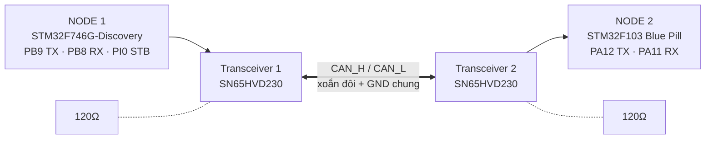

# Automotive CAN Telematics Gateway & Diagnostic Node

[-red.svg)](#node-1-stm32f746ng-telematics-gateway)
[-orange.svg)](#node-2-stm32f103c8t6-ecu-simulator)
[](#node-1-stm32f746ng-telematics-gateway)
[](#node-2-stm32f103c8t6-ecu-simulator)
[](#định-dạng-bản-tin-can-vector-dbc)
[](LICENSE)

Hệ thống gồm 2 vi điều khiển giao tiếp qua CAN Bus vật lý, tái hiện đúng kiến trúc mạng CAN trên ô tô thật: **Node 2** (STM32F103, bare-metal) đóng vai ECU động cơ/hộp số/phanh, liên tục phát dữ liệu cảm biến lên bus; **Node 1** (STM32F746, Zephyr RTOS) đóng vai Gateway/Cụm đồng hồ, thu nhận, giải mã và xác thực dữ liệu theo chuẩn AUTOSAR E2E Profile 1, đồng thời cung cấp giao diện chẩn đoán qua CLI.

---

## Mục Lục

- [Kiến Trúc Tổng Quan](#kiến-trúc-tổng-quan)
- [Tính Năng Chính](#tính-năng-chính)
- [Định Dạng Bản Tin CAN (Vector DBC)](#định-dạng-bản-tin-can-vector-dbc)
- [Luồng Dữ Liệu End-to-End](#luồng-dữ-liệu-end-to-end)
- [Yêu Cầu Phần Cứng](#yêu-cầu-phần-cứng)
- [Sơ Đồ Đấu Dây](#sơ-đồ-đấu-dây)
- [Bắt Đầu Nhanh](#bắt-đầu-nhanh)
  - [Node 1: STM32F746NG Telematics Gateway](#node-1-stm32f746ng-telematics-gateway)
  - [Node 2: STM32F103C8T6 ECU Simulator](#node-2-stm32f103c8t6-ecu-simulator)
- [Bộ Lệnh Chẩn Đoán (Zephyr Shell CLI)](#bộ-lệnh-chẩn-đoán-zephyr-shell-cli)
- [Demo](#demo)
- [Cấu Trúc Thư Mục](#cấu-trúc-thư-mục)
- [Giới Hạn Hiện Tại & Hướng Phát Triển](#giới-hạn-hiện-tại--hướng-phát-triển)
- [Thông Tin Tác Giả](#thông-tin-tác-giả)

---

## Kiến Trúc Tổng Quan


```mermaid
flowchart LR
    subgraph B2["NODE 2: STM32F103C8T6"]
        direction TB
        S2["Cảm biến giả lập<br/>speed · rpm · gear · torque · brake"]
        E2["DBC Encoder<br/>CRC-8 + Rolling Counter"]
        M2["3x TX Mailbox"]
        S2 --> E2 --> M2
    end

    M2 ==>|"CAN_H / CAN_L · 500 kbps"| BUS(("CAN Bus"))
    BUS ==> F1

    subgraph B1["NODE 1: STM32F746NG"]
        direction TB
        F1["Filter Bank<br/>0x120–0x127"] --> Q1[("k_msgq")]
        Q1 --> W1["can_worker<br/>decode + E2E check"]
        W1 --> D1[("telemetry<br/>+ DTC")]
        D1 --> CLI1["Shell CLI"]
    end

    classDef node2 fill:#2d2d2d,stroke:#ff9800,color:#fff,stroke-width:2px
    classDef node1 fill:#2d2d2d,stroke:#2196f3,color:#fff,stroke-width:2px
    classDef bus fill:#1a1a1a,stroke:#4caf50,color:#4caf50,stroke-width:2px
    class S2,E2,M2 node2
    class F1,Q1,W1,D1,CLI1 node1
    class BUS bus
```

Node 2 phát 3 bản tin CAN đa chu kỳ (20ms / 50ms / 100ms), đại diện cho 3 hệ thống con của xe: động cơ, hộp số và phanh. Node 1 thu nhận, giải mã theo chuẩn AUTOSAR E2E, giám sát an toàn và phản hồi qua Shell CLI. Hai đầu hệ thống là hai thái cực có chủ đích: lập trình bare-metal trực tiếp thanh ghi ở Node 2, và hệ điều hành Zephyr RTOS ở Node 1.

---

## Tính Năng Chính

* **Mạng CAN 2 node độc lập:** 2 bo mạch vật lý tách biệt nối qua bus vi sai CAN_H/CAN_L bằng 2 IC Transceiver và điện trở đầu cuối 120Ω, kiểm chứng đúng tầng vật lý ISO 11898.
* **3 bản tin CAN theo phân hệ ô tô:** `0x123` Engine (tốc độ, vòng tua, nhiệt độ nước), `0x124` Transmission (tay số, mô-men xoắn), `0x125` Chassis (áp lực phanh). Mỗi bản tin mang Rolling Counter độc lập, phát đồng thời qua 3 Mailbox phần cứng của bxCAN.
* **Xác thực 2 lớp AUTOSAR E2E Profile 1:** CRC-8 (đa thức SAE J1850 `0x2F`, tính bằng bảng tra 256 phần tử) kết hợp Rolling Counter dạng delta (phân biệt khung lặp, rớt 1 khung hoặc rớt nhiều khung).
* **Bộ lọc phần cứng theo dải ID:** 1 Filter Bank (`id=0x120, mask=0x7F8`) bao trọn 3 bản tin và dự phòng không gian cho các ECU mở rộng trong cùng dải ID.
* **Giám sát an toàn thời gian thực (DTC):** Phát hiện quá nhiệt động cơ (>105°C gán `DTC_P0115`), quá vòng tua (>6500 RPM gán `DTC_P0219`), mất tín hiệu CAN quá 1000ms (`DTC_U0100`), dữ liệu sai lệch khi vi phạm E2E (CRC sai hoặc Replay) tích luỹ đủ 3 lần (`DTC_U0401`), nhấp nháy đèn cảnh báo PI1.
* **Thống kê mạng thời gian thực:** Đếm tổng khung nhận, tỉ lệ hợp lệ E2E, số lỗi CRC, số khung rớt và lưu lượng riêng từng ID qua lệnh `can stat`.
* **Bộ mô phỏng và chẩn đoán tích hợp trong Node 1:** `sim_thread` hỗ trợ phát dữ liệu xe chạy nội bộ; tập lệnh `can inject` (`overheat`, `overspeed`, `timeout`, `corrupt`, `replay`, `drop`) cho phép chủ động bơm lỗi ngay trong bộ giải mã để kiểm thử logic an toàn mà không cần thiết bị gây nhiễu thật.
* **Chẩn đoán qua Zephyr Shell CLI:** Giao diện dòng lệnh tương tác qua UART (`vehicle status`, `dtc read/clear`, `can sim/auto/inject/stat/stat_reset`).
* **Bảo vệ ngăn xếp bằng phần cứng MPU:** Sử dụng `CONFIG_HW_STACK_PROTECTION` và `CONFIG_MPU_STACK_GUARD` phát hiện lỗi tràn stack tức thì.

---

## Định Dạng Bản Tin CAN (Vector DBC)

Cả 3 bản tin dùng chung định dạng Byte 0-1 (CRC-8 và Rolling Counter) theo chuẩn AUTOSAR E2E, khác nhau ở Byte 2-5 (payload tín hiệu):

| Byte | `0x123`: Engine (MB0) | `0x124`: Transmission (MB1) | `0x125`: Chassis/Brake (MB2) |
| :--- | :--- | :--- | :--- |
| 0 | E2E CRC-8 (poly `0x2F`, seed `0xFF`, XOR-out `0xFF`, Data ID `0x1A2B`) | Giống cột trái | Giống cột trái |
| 1 | Rolling Counter 4-bit (0-15, modulo 16, riêng từng ID) | Giống, bộ đếm độc lập | Giống, bộ đếm độc lập |
| 2 | Vehicle Speed: 0-240 km/h, factor 1, Little-Endian | Gear Position: 1-5 | Brake Pressure: % |
| 3-4 | Engine RPM: Little-Endian, factor 0.25 (`raw = d[3] \| (d[4]<<8)`, `RPM = raw>>2`) | Engine Torque (Nm): Little-Endian | Wheel Speed: Little-Endian |
| 5 | Coolant Temp: `raw = temp + 40` | Oil Temp: `raw = temp + 40` | Pad Temp: `raw = temp + 40` |
| 6-7 | Reserved `0x00` | Reserved `0x00` | Reserved `0x00` |

DLC = 8 bytes cho cả 3 bản tin; Chuẩn Standard ID 11-bit.

---

## Luồng Dữ Liệu End-to-End

1. **Node 2** định kỳ đọc cảm biến giả lập, đóng gói 3 bản tin, tính CRC-8 qua bảng tra và tăng Rolling Counter tương ứng.
2. **`CAN1_Transmit()`** kiểm tra cờ `TME0/TME1/TME2`, chọn Mailbox phần cứng rảnh để nạp 3 khung gần như đồng thời mà không bị trễ luân phiên.
3. Bus CAN phân xử theo cơ chế bitwise arbitration: bản tin `0x123` được ưu tiên truyền trước `0x124`, sau đó tới `0x125`.
4. **Node 1** thu nhận qua Filter Bank dải `0x120-0x127`, nạp vào hàng đợi `k_msgq`.
5. **`can_worker_thread`** (Priority 5) giải mã theo `can_id`, xác thực CRC-8 và delta counter, cập nhật cấu trúc `VehicleTelemetry_t`.
6. **`safety_thread`** (Priority 6) chu kỳ 200ms kiểm tra ngưỡng vận hành, cập nhật cờ DTC và điều khiển LED cảnh báo (PI1).
7. Người vận hành truy vấn trạng thái qua **Shell CLI** trên cổng UART.

---

## Yêu Cầu Phần Cứng

| Hạng mục | Node 1 (Gateway) | Node 2 (ECU Simulator) |
| :--- | :--- | :--- |
| **Bo mạch** | STM32F746G-Discovery | STM32F103C8T6 (Blue Pill) |
| **Toolchain** | West + Zephyr SDK (`arm-zephyr-eabi-gcc`) | GCC Arm Toolchain (`arm-none-eabi-gcc`) hoặc Keil MDK |
| **Module CAN Transceiver** | 1x Module (SN65HVD230 3.3V hoặc TJA1050 5V) | 1x Module (SN65HVD230 3.3V hoặc TJA1050 5V) |
| **Nạp chương trình** | Cáp Mini-USB (ST-LINK on-board) | Mạch nạp ST-LINK V2 rời hoặc nạp qua UART bootloader |
| **Kết nối vật lý** | Cáp xoắn đôi vi sai CAN_H/CAN_L, dây nối đất GND chung, 2 điện trở kết thúc 120Ω |

---

## Sơ Đồ Đấu Dây


```mermaid
flowchart LR
    N1["NODE 1<br/>STM32F746G-Discovery<br/>PB9 TX · PB8 RX · PI0 STB"] --> T1["Transceiver 1<br/>SN65HVD230"]
    T1 <==>|"CAN_H / CAN_L<br/>xoắn đôi + GND chung"| T2["Transceiver 2<br/>SN65HVD230"]
    T2 --> N2["NODE 2<br/>STM32F103 Blue Pill<br/>PA12 TX · PA11 RX"]

    R1["120Ω"] -.- T1
    T2 -.- R2["120Ω"]
```

| Tín hiệu | Node 1 (F746) | Node 2 (F103) | Cả 2 Transceiver (SN65HVD230) |
| :--- | :--- | :--- | :--- |
| **TX → CTX** | PB9 (Header CN4, D14) | PA12 | CTX / TXD |
| **CRX → RX** | PB8 (Header CN4, D15) | PA11 | CRX / RXD |
| **STB / Rs** | PI0 kéo LOW (Header CN7, D5) | Nối thẳng GND | Rs / STB |
| **VCC** | 3.3V (CN6) | 3.3V | 3V3 |
| **GND** | Chung 1 điểm mass với Node 2 | Chung 1 điểm mass với Node 1 | GND |
| **Bus** | — | — | CAN_H, CAN_L nối xoắn đôi giữa 2 module + 1 điện trở 120Ω mỗi đầu |

**Ghi chú nhanh:**
- Dùng **TJA1050 (5V)** thay vì SN65HVD230: cấp nguồn transceiver từ chân 5V — an toàn vì PB8 (F746) là chân 5V-tolerant.
- Bật `USE_CAN_REMAP_PB8_PB9=1` trong firmware Node 2 nếu muốn đổi PA11/PA12 sang PB8/PB9.
- LED cảnh báo PI1 (Node 1) và LED PC13 (Node 2) đều có sẵn trên board, không cần đấu thêm.

**Kiểm tra nhanh trước khi cấp nguồn:**
1. Đo GND giữa 2 board — phải ~0V (chênh lệch lớn có thể hỏng bộ thu do vượt dải Common-Mode).
2. Tắt nguồn, đo trở kháng CAN_H↔CAN_L — phải trong khoảng **55-65Ω** (2 trở 120Ω song song). Đo ra ~120Ω nghĩa là thiếu 1 trở; đo hở mạch nghĩa là thiếu cả 2.

---

## Bắt Đầu Nhanh

### Node 1: STM32F746NG Telematics Gateway

```bash
cd node1_stm32f7_gateway
west build -b stm32f746g_disco .
west flash
```

Mở terminal UART ở tốc độ 115200 baud để theo dõi log và nhập lệnh Shell. Mặc định firmware chạy ở `CAN_MODE_NORMAL` (giao tiếp qua chân PB8/PB9 thực tế). Khi muốn tự kiểm thử mà không có Node 2 thật:
1. Thêm dòng `target_compile_definitions(app PRIVATE USE_CAN_LOOPBACK_MODE)` vào `CMakeLists.txt`, hoặc
2. Bỏ chú thích dòng `/* loopback; */` trong file `app.overlay`.

Sau đó gõ lệnh `can auto on` để luồng `sim_thread` kích hoạt dữ liệu mô phỏng.

### Node 2: STM32F103C8T6 ECU Simulator

```bash
cd node2_stm32f103_ecu
make            # Hoặc: cmake -B build && cmake --build build
```

Nạp file `stm32f103_node.bin` hoặc `.hex` qua ST-LINK V2 hoặc USB-TTL. Đèn LED PC13 chớp tắt đều đặn xác nhận chu kỳ phát đang diễn ra. Thư mục mã nguồn cũng cung cấp sẵn project `stm32f103_node.uvprojx` cho Keil MDK.

**Kiểm thử liên lạc toàn hệ thống:**
1. Cấp nguồn cho cả 2 node và kết nối đủ 3 đường CAN_H, CAN_L, GND.
2. Trên console Shell của Node 1, nhập lệnh:
   ```text
   uart:~$ can stat
   ```
   Kiểm tra số đếm của 3 định danh `id_123_count`, `id_124_count`, `id_125_count` tăng đều với tần số 10 Hz và tỉ lệ hợp lệ đạt 100%.
3. Nhập lệnh:
   ```text
   uart:~$ vehicle status
   ```
   để xem toàn bộ thông số giải mã từ 3 phân hệ.

---

## Bộ Lệnh Chẩn Đoán (Zephyr Shell CLI)

| Lệnh | Chức năng thực thi |
| :--- | :--- |
| `vehicle status` | Hiển thị tốc độ xe, RPM, nhiệt độ nước làm mát, cấp số, mô-men xoắn, áp lực phanh và trạng thái E2E |
| `dtc read` | Đọc danh sách các mã lỗi chẩn đoán (DTC) đang kích hoạt |
| `dtc clear` | Xóa toàn bộ mã lỗi DTC và tắt đèn cảnh báo an toàn |
| `can stat` | Báo cáo thống kê: tổng khung, tỉ lệ E2E hợp lệ, số lỗi CRC, số khung mất và đếm theo từng ID |
| `can stat_reset` | Khởi tạo lại toàn bộ bộ đếm thống kê về 0 |
| `can sim <speed_kmh>` | Phát thủ công 1 khung dữ liệu giả lập với tốc độ chỉ định |
| `can auto <on\|off>` | Bật hoặc tắt luồng `sim_thread` tự phát dữ liệu xe chạy tần số 5 Hz |
| `can inject <overheat\|overspeed\|timeout\|corrupt\|replay\|drop [n]>` | Bơm lỗi giả lập tại bộ giải mã Node 1 (không phát lên bus) để kiểm tra module DTC và lớp E2E |

---

## Demo

Demo chạy trên 2 board thật qua bus CAN 500 kbps, toàn bộ thao tác bằng Zephyr Shell của Node 1. Kịch bản gồm hai phần: rút/cắm dây Transceiver để xem hệ thống phát hiện mất kết nối rồi tự phục hồi, và thử lớp an toàn (quản lý DTC, bơm lỗi E2E).

> Các lệnh `can inject corrupt` và `can inject replay` giả lập lỗi ngay trong bộ giải mã của Node 1 (đánh dấu khung kế tiếp là sai CRC hoặc trùng Counter), không phải nhiễu thật trên dây bus.

### 1. Trạng thái E2E khi rút và cắm lại dây


Lệnh `vehicle status` hiển thị thông số xe kèm dòng **E2E Integrity**:
- Dây còn cắm: `VALID (OK)`.
- Rút dây Transceiver: `dtc read` báo `DTC_U0100`, `vehicle status` chuyển sang `TIMEOUT / LOST COMM (FAIL)`. Các số hiển thị là giá trị nhận được gần nhất trước khi mất tín hiệu.
- Cắm dây lại: tự trở về `VALID (OK)`, không cần reset Node 1.

### 2. Rút dây: khung nhận ngừng tăng


`dtc read` báo `DTC_U0100` (mất tín hiệu CAN quá 1000 ms). Các lần `can stat` liên tiếp đều cho 912 frames: khi dây bị rút, bộ đếm khung nhận đứng yên. Số khung ở ba Mailbox vẫn chia đúng tỉ lệ 5 : 2 : 1 (`570 : 228 : 114`), khớp chu kỳ phát 20 / 50 / 100 ms của Node 2.

### 3. Cắm lại dây: khung nhận tăng tiếp, ghi nhận khung rớt


Sau khi cắm lại, `can stat` tăng từ 912 lên 1113 frames. Mục `Frame bi rot tren bus` hiện 24: bộ giải mã nhận ra bước nhảy Rolling Counter và cộng dồn số khung đã bỏ lỡ trong lúc mất kết nối. `Frame sai ma CRC-8` vẫn bằng 0 vì dữ liệu nhận được không bị hỏng, chỉ mất một đoạn.

### 4. Xoá mã lỗi: một mã hoặc toàn bộ


Khi hệ thống có nhiều mã lỗi, có thể xoá riêng từng mã đã xử lý xong hoặc xoá tất cả. Phiên này bắt đầu với `DTC_U0100` còn tồn đọng từ lần mất kết nối:
1. `can inject overheat` và `can inject overspeed` thêm `DTC_P0115` và `DTC_P0219`; `dtc read` liệt kê 3 mã.
2. `dtc clear P0115` chỉ xoá đúng mã đó, còn lại `U0100` và `P0219`.
3. Bơm `overheat` lần nữa rồi `dtc clear` (không tham số): xoá toàn bộ, `dtc read` báo 0 lỗi.

### 5. Khung sai CRC-8 (`can inject corrupt`)


Mỗi lần bơm lỗi, log cảnh báo `Sai ma CRC-8` (ví dụ nhận `0xFD`, tính ra `0x57`) và shell báo số lần vi phạm E2E: `1/3`, `2/3`. Đến lần thứ 3, `safety_monitor` ghi `DTC_U0401` (dữ liệu sai lệch). Lệnh `can stat` cho biết cụ thể số khung sai CRC (tăng từ 1 lên 3) trong khi các khung hợp lệ vẫn tăng đều. Bộ đếm vi phạm cộng dồn theo thời gian và chỉ được xoá bằng `dtc clear`.

### 6. Khung trùng lặp Rolling Counter (`can inject replay`)


Tương tự mục 5 nhưng với lỗi trùng Counter: log ghi `Duplicate Frame ID 0x123 ... Replay Attack`, `can stat` tăng mục `Frame bi trung lap` (còn `Frame sai ma CRC-8` giữ nguyên 0). Hai loại vi phạm dùng chung một ngưỡng 3 nên lần thứ 3 cũng kích hoạt `DTC_U0401`.

---

## Cấu Trúc Thư Mục

```text
automotive_can_gateway_cluster/
├── node1_stm32f7_gateway/          # Node 1: Zephyr RTOS trên STM32F746NG
│   ├── src/
│   │   ├── main.c                  # 2 luồng chính: can_worker (prio 5), safety (prio 6)
│   │   ├── can_gateway.c/.h        # Khởi tạo CAN, quản lý chân STB, cấu hình Filter Bank dải ID
│   │   ├── dbc_decoder.c/.h        # Bộ giải mã DBC theo ID, kiểm tra E2E, thống kê mạng
│   │   ├── safety_monitor.c/.h     # Máy trạng thái quản lý mã lỗi DTC
│   │   └── diag_shell.c            # Shell CLI, luồng mô phỏng sim_thread (prio 7), bộ bơm lỗi
│   ├── app.overlay                 # Devicetree: ánh xạ chân CAN1, LED cảnh báo, chân STB
│   ├── prj.conf                    # Cấu hình Kconfig: CAN Subsystem, Shell, MPU Stack Guard
│   └── CMakeLists.txt
├── node2_stm32f103_ecu/            # Node 2: Bare-Metal trên STM32F103C8T6
│   ├── src/
│   │   ├── main.c                  # Mô phỏng cảm biến và phát 3 bản tin đa chu kỳ 20/50/100ms
│   │   ├── can_f103.c              # Driver thanh ghi bxCAN, thuật toán round-robin 3 Mailbox
│   │   └── e2e_encoder.c           # Đóng gói DBC và tính CRC-8 (Lookup Table) cho 3 bản tin
│   ├── include/can_f103.h, e2e_encoder.h
│   ├── startup_stm32f103c8tx.s     # Vector table và mã Reset Handler
│   ├── stm32f103c8tx.ld            # Linker script phân bổ bộ nhớ Flash và SRAM
│   ├── Makefile / CMakeLists.txt / stm32f103_node.uvprojx
│   └── README.md                   # Hướng dẫn chi tiết biên dịch và nạp riêng cho Node 2
├── docs/images/                    # Ảnh chụp terminal dùng trong mục Demo
└── README.md                       # Tài liệu tổng quan toàn bộ hệ thống
```

---

## Giới Hạn Hiện Tại & Hướng Phát Triển

* **Mã lỗi DTC hiện tại:** Module `safety_monitor` đang tập trung giám sát 2 ngưỡng giới hạn từ bản tin động cơ (nhiệt độ nước >105°C và vòng tua >6500 RPM). Hướng mở rộng tiếp theo là bổ sung DTC cho áp lực phanh bất thường (`0x125`) và sai lệch cấp số/mô-men xoắn (`0x124`).
* **Cấu hình Bit Timing:** Node 1 sử dụng cơ chế tự động tính toán tham số thanh ghi `CAN_BTR` của Zephyr thông qua khai báo `sample-point = <875>` trong Devicetree. Việc can thiệp trực tiếp giá trị thanh ghi BRP, TS1, TS2 chỉ thực hiện ở Node 2 bare-metal.
* **Xử lý ngắt bộ đệm:** Hàm `can_add_rx_filter_msgq()` sử dụng driver `can_stm32_bxcan` tích hợp sẵn của Zephyr; việc đọc dữ liệu từ thanh ghi FIFO và giải phóng cờ `RFOM0` do driver đảm nhiệm.
* **Bộ lọc Node 2:** Node 2 hiện sử dụng bộ lọc chấp nhận tất cả (`CAN1_Filter_Config(0x000, 0x000)`) để đơn giản hóa quá trình nghe phản hồi thử nghiệm hai chiều.
* **Cơ chế báo lỗi ACK tại Node 2:** Hàm `CAN1_Transmit()` chỉ kiểm tra tính sẵn sàng của 3 Mailbox qua cờ `TME0/1/2` trong `CAN_TSR`. Nếu bus mất tín hiệu ACK vật lý từ Node 1, phần cứng bxCAN sẽ tự động phát lại mà không có cờ cảnh báo cấp phần mềm trả về ở tầng ứng dụng Node 2.

---

## Thông Tin Tác Giả

* **Chuyên ngành:** Công Nghệ Kỹ Thuật Máy Tính (Computer Engineering Technology)
* **Đơn vị:** Trường Đại học Sư phạm Kỹ thuật TP.HCM (HCMUTE)
